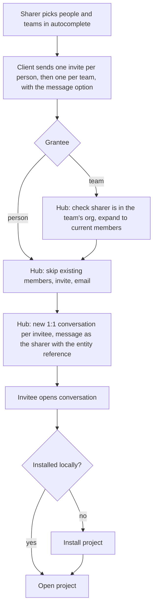
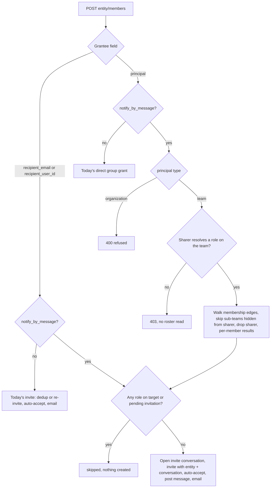
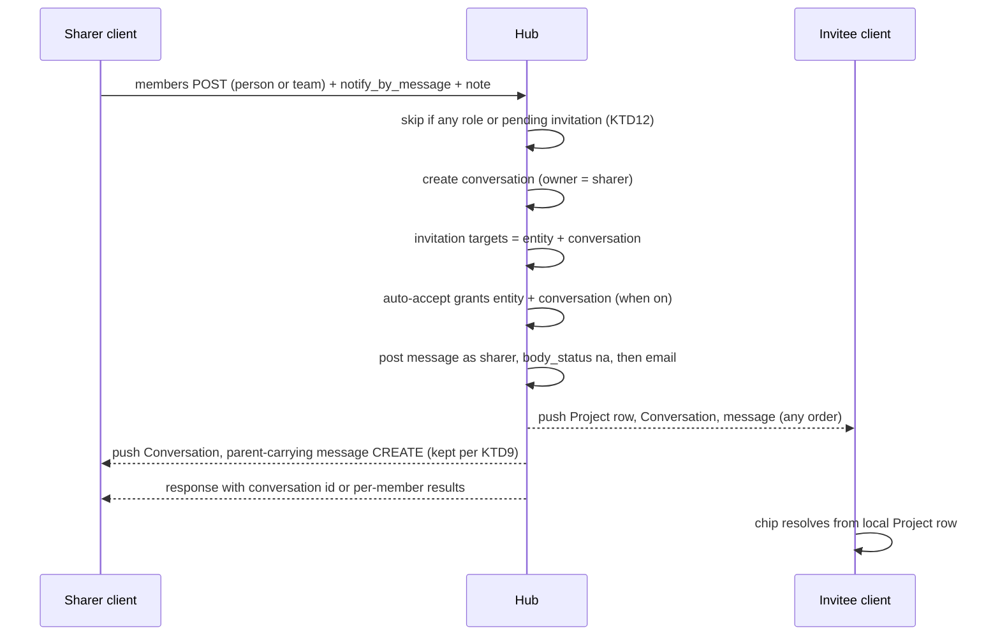
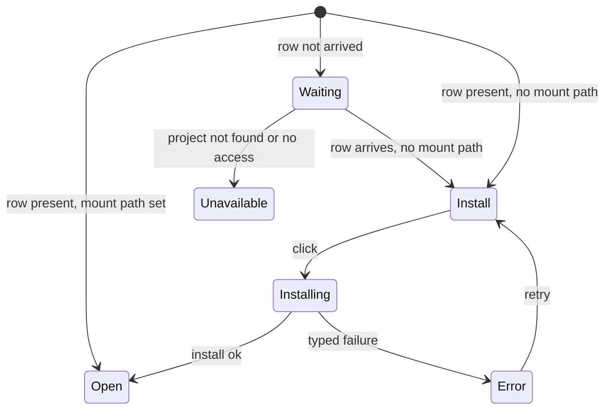
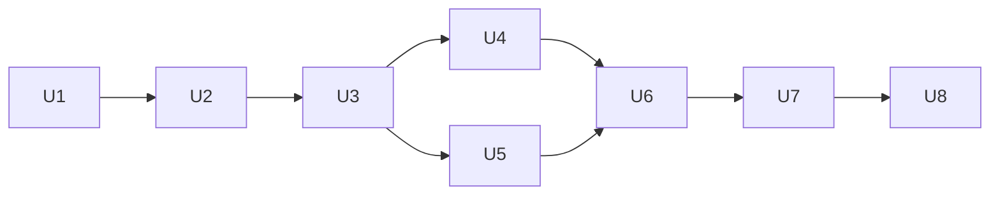

# Project Share Invite Thread - Plan

## Goal Capsule

* **Objective:** A person invited to a published project — individually or through a team — learns about it from a message by the inviter in their own new conversation with the inviter, and installs the project into their Flowpad Workspace with one click from that message.

* **Means:** an opt-in "send a Flowpad message" option on the hub's existing member-invite action, generic across entity types, which project sharing turns on (KTD1).

* **Product authority:** the Product Contract below, then the Planning Contract's KTDs. Work spans this repo (`flowpad`, desktop client) and the sibling hub repo (`flowpad-hub`).

* **Stop conditions:** stop and ask before (a) any hub read or authorization change beyond the team-expansion gate in R17, (b) moving per-member messaging off the request path, (c) raising any timeout to make a test pass, (d) implementing U2 while the email-exposure question in Open Questions is unanswered.

* **Execution profile:** hub units first (U1, U2), then client units (U3–U8); each unit lands as its own commit in its own repo.

***

## Product Contract

Product Contract preservation: changed R3, R6, R7, R9 and added R15–R18 — the user redirected the design during planning (option on the members action instead of a share batch, one conversation per invitee instead of one per share, org-wide team sharing, generic plumbing up to the chip, organizations refused); retired AE7's hub-web case with R9's old scope.

### Summary

When a project is shared, each new invitee gets their own new conversation with the sharer, opened by the hub, holding a message from the sharer with an **Install project** chip.
The sharer picks people and teams in the existing share autocomplete; the hub expands a picked team to its current members.
The message is the only way a shared project is offered to its recipient, replacing today's auto-popup.

### Problem Frame

Today a shared project reaches the invitee as a Project row the hub pushes when membership is granted: remote, carrying a git origin, with no local folder.
A client-side watcher spots rows of that shape and pops "X shared a project with you", where X is guessed from the GitHub repo owner because the row does not know who invited.
The popup is transient — once dismissed, nothing durable tells the invitee the project exists or who sent it, and there is no place to ask the inviter about it.
The invite email exists but lands the invitee on the same uninstalled row.
Teams can be invited only from the People & teams page, and only by team admins, because the client expands a team by reading a roster that hides other people's emails below admin.

### Actors

* A1. Sharer — a Flowpad user allowed to invite members to a published project.

* A2. Invitee — the person being invited; an existing Flowpad user or an email-only contact.

* A3. Hub — grants memberships, sends invite emails, expands teams, creates the conversation and posts the invite message.

* A4. Invitee's Flowpad client — shows the conversation and chip and performs the install.

### Key Decisions

* **The hub authors the invite message, not the sharer's client.** Governs R6, R7. (session-settled: user-directed — chosen over installing from the project list with no message, and over the sharer's client sending the message: one delivery path owned by the hub)

* **Delivery is an option on the existing member-invite action, not a new share action.** Governs R9, R15. (session-settled: user-directed — chosen over a new project share action, a list-shaped members request, and a share-id correlation field: the members action already branches person vs team)

* **One new conversation per invitee, with the sharer.** Governs R6, R8. (session-settled: user-directed — chosen over one group conversation per share and over reusing a per-project thread: simpler, and the invitation is personal)

* **The message chip replaces the auto-popup.** Governs R12. (session-settled: user-directed — chosen over keeping the popup as a fallback and over keeping both: one arrival path)

* **A team is a snapshot of its current members, expanded by the hub.** Governs R3, R16. (session-settled: user-directed — chosen over a live team-as-a-unit grant and over client-side expansion: only the hub can read a team's roster for a non-admin sharer)

* **Anyone in a team's organization may share with that team.** Governs R17. (session-settled: user-directed — chosen over team members plus admins, and over admins only: most useful; member names become visible through the conversations, emails stay as today's roster rules show them)

* **Everything is generic until the install chip.** Governs R15, R11. (session-settled: user-directed — chosen over project-specific plumbing: the option, expansion and message reference serve any entity; only the chip knows projects)

* **Teams are picked in the existing autocomplete.** Governs R1, R2. (session-settled: user-directed — chosen over a new publish-and-invite dialog and over keeping team invites on the People & teams page only)

* **Install reuses the existing clone-and-bind behavior.** Governs R11.

### Requirements

**Picking invitees**

* R1. The sharer invites from the existing project share surface; an unpublished project is published first, under the existing publish checks.

* R2. The share autocomplete suggests teams from the sharer's organizations alongside people, matching on the team name as the sharer types, and a picked team shows as a single entry.

* R3. On send, the hub expands each picked team to its members at that moment, including members of nested teams.

* R4. Only new invitees are invited: the sharer, anyone who already holds a role on the project, anyone with a pending invitation to it, and repeat picks of the same person get no invite and no message.

**Delivery**

* R5. Each newly invited person receives a project membership and the existing invite email.

* R6. Each newly invited person gets exactly one new conversation, titled after the project, whose participants are the sharer and that person.

* R7. The hub posts one message into that conversation in the sharer's name: a generic invite text, the sharer's personal note when one was given, and a reference to the shared entity.

* R8. An invite never posts into an earlier conversation, even when the entity and the person are the same.

* R9. Message delivery is an opt-in option of the existing member-invite action; every project share surface in the desktop client turns it on.

* R10. An email-only invitee who later joins Flowpad finds the invite conversation and its chip once signed in.

* R18. In the sharer's conversation list, each invite conversation is distinguishable by the invitee's name.

**Generic behavior and limits**

* R15. The message option, team expansion and message reference work for any entity the members action accepts; only the chip in R11 and R13 is specific to projects.

* R16. An invite naming an organization as the grantee with the message option set is refused; without the option, today's direct group grant is unchanged.

* R17. A sharer may expand a team only when they hold a role on that team or on an organization the team belongs to.

**Install chip**

* R11. For a project reference, the chip's action installs the project into the invitee's Flowpad Workspace, reusing a matching local checkout when one exists.

* R12. The auto-popup that offers newly shared projects is removed; the chip is the only place a shared project is offered.

* R13. The chip reflects the invitee's local state: **Install project** while the project is not installed, **Open project** once it is, wherever the install happened.

* R14. When the install fails because the invitee cannot access the repository — for example a private GitHub repo they are not a collaborator on — the chip says so and the project stays uninstalled.

### Key Flows

* F1. Share with people and a team

  * **Trigger:** A1 opens the share surface on a project.

  * **Actors:** A1, A3

  * **Steps:** A1 types "isha" and picks <ishay@langware.ai>, types "zs" and picks team zschool, optionally adds a note, and sends. The project is published if it is not yet. The hub invites and emails each new person, expands zschool, and gives every new invitee their own conversation with the message.

  * **Outcome:** every new invitee has the invite email and a new conversation with the sharer holding the chip.

  * **Covered by:** R1, R2, R3, R4, R5, R6, R7, R17

* F2. Invitee installs from the chip

  * **Trigger:** A2 opens the invite conversation.

  * **Actors:** A2, A4

  * **Steps:** A2 clicks Install project; the project is placed in the Flowpad Workspace; the chip turns into Open project.

  * **Outcome:** the project is installed and bound locally, or the chip explains why it could not be.

  * **Covered by:** R11, R13, R14

### Acceptance Examples

* AE1. **Covers R3, R4, R6.** **Given** team zschool holds the sharer, Dana and Eli, and Dana already has a role on project P, **when** the sharer shares P with zschool, **then** only Eli is invited, and Eli gets one new conversation with the sharer.

* AE2. **Covers R4.** **Given** Eli is picked by name and is also in picked team zschool, **when** the share is sent, **then** Eli gets one email and one conversation.

* AE3. **Covers R4, R6.** **Given** everyone picked already has a role on P, **when** the share is sent, **then** no conversation is created and no email is sent.

* AE4. **Covers R8.** **Given** the sharer shared P with Eli last week, **when** they share P with Noa today, **then** Noa gets a new conversation and Eli's conversation is untouched.

* AE5. **Covers R13.** **Given** Eli already installed P, **when** Eli opens a second invite conversation for P, **then** its chip reads Open project.

* AE6. **Covers R14.** **Given** P's repo is private and Eli is not a collaborator, **when** Eli clicks Install project, **then** the chip shows that Eli lacks access to the repository and nothing is installed.

* AE8. **Covers R16.** **Given** the sharer names organization Acme as the grantee with the message option, **when** the invite is sent, **then** the hub refuses it and nobody is invited.

* AE9. **Covers R17.** **Given** team zschool belongs to an organization the sharer holds no role in, **when** the sharer invites zschool with the message option, **then** the hub refuses it and reveals nothing about zschool's members.

* AE10. **Covers R15.** **Given** the sharer invites Noa to an agent with the message option, **when** Noa opens the conversation, **then** the message references the agent and no install-project chip appears.

### Scope Boundaries

* Live team grants, where the team holds the role and future members inherit access — deferred.

* Telling people who join a team after the share — deferred; they are not invited.

* Expanding an organization into its members — refused (R16); a possible follow-up.

* An install surface for grants that arrive without a message (invite links, grants from clients that do not set the option, projects shared before this ships) — out of scope; invite links already reach people by email.

* Messages for invite-link redemptions and for invites from the hub web members UI — out of scope.

* Support for older desktop clients receiving the new message — not a requirement.

* Giving invitees access to the git repository itself — outside scope; Flowpad grants Flowpad membership, not GitHub access.

* Changing the invite email's content or design — outside scope.

### Dependencies / Assumptions

* Adopted default, not explicitly confirmed: teams appear in the autocomplete for project sharing only; the picker capability itself is generic.

* The hub accepts an existing user's invite without an accept step when its auto-accept-on-invite setting is on (the production default); hub tests default it off.

* The hub today never creates a conversation or posts a message as a side effect of a membership grant; R6 and R7 add that.

* A project reference cannot travel as a message attachment today without being treated as a body upload; KTD4 makes a reference body-free.

### Sources / Research

* `flow_sdk/builtin/project.py` — `Project.share` (publish, per-person `members` calls, existing-member skip via `_hub_member_identities`) and `setup_from_git_origin` (recipient install).

* `flow_sdk/fs_store/origin/git_origin.py` — `next_clone_target`: reuses a workspace folder only when its git remote and branch match.

* `ts_sdk/src/APIEntity.ts` — `inviteMember` (person, `notifyByEmail`) and `addGroupMember` (`principal`), the two call shapes this work extends.

* `ui/src/components/task-receive/use-incoming-shared-projects.ts` — the auto-popup this work removes.

* `ui/src/components/conversation/FlowMessageBubble.tsx` — `MessageEntityChip`, whose `folder` branch is the model for the project chip.

* `ui/src/components/contact-picker/ContactPicker.tsx`, `use-contacts.ts` — the autocomplete and its person keying.

* `flow_sdk/cloud_client/hub_bridge.py` — the self-send drop that hides hub-authored messages from the sharer.

* `docs/collab/sharing-and-sync.md`, `docs/collab/messages-and-attachments.md`, `docs/collab/hub-fanout-and-loader.md`, `docs/collab/invites-members-identity.md`.

* `flowpad-hub/flowpad/hub/app/actions/membership/services.py` — `create_membership` (person vs `principal` branch at the group-grant early return, per-target type checks), `_maybe_auto_accept`, `_send_invite_email`, `_build_invitation_relationships`.

* `flowpad-hub/flowpad/hub/builtin/invitation.py` — `MembershipRequest`, `_GRANTABLE_PRINCIPAL_TYPES`, pending feed embedding a conversation and its preview message.

* `flowpad-hub/flowpad/hub/builtin/project.py` — `start_guest_conversation`, the only precedent for the hub creating a conversation and posting a message on a user's behalf.

* `flowpad-hub/flowpad/hub/app/actions/membership/repository.py` — roster PII redaction below admin; `get_member_users` group expansion.

***

## Planning Contract

**Target repos.** Paths prefixed `flowpad-hub/` live in the sibling hub repo; every other path is relative to this repo (`flowpad`).

### Key Technical Decisions

* KTD1. **Add a** **`notify_by_message`** **flag to** **`MembershipRequest`, beside** **`notify_by_email`, default false.** When set on a person invite, the person path in `create_membership` opens the invite conversation after it has decided to create a new invitation; when set on a `team-…` principal, the principal branch expands the team (KTD5). Generic across target types (R15). (session-settled: user-directed — chosen over a new project share action and a list-shaped request: branch inside the members action that already splits person from group) Governs R9, R15.

* KTD2. **The invite conversation rides as a second target on the same invitation.** The hub creates the conversation (root-level, owned by the sharer, `initiated_by` the sharer, titled after the target entity) before `create_invitation_for_targets` and adds it to `invitation_targets` at `member`. Accept, auto-accept-on-invite and auto-accept-on-signup then grant the entity and the conversation together, the pending-invitations feed already embeds the conversation with its preview message, and an email-only invitee's roles land on the shadow user (R10). The conversation is root-level, not a child of the project, because a project's child conversation is readable by every project member, which would leak the note. Governs R6, R10.

* KTD3. **The hub posts the message with the** **`start_guest_conversation`** **stamping pattern.** `sender_id`/`sender_name` are the sharer, `kind` stays `user`, text is a hub-authored generic line plus the note from `MembershipRequest.message`, and the one attachment is `type_id` `<type>-<id>` for the target entity. The message is posted after `_maybe_auto_accept` and before the email, inside the same request: with auto-accept on, the invitee is already a conversation member and receives the message live (notification, unread, preview); with it off, the message still exists as the pending feed's preview. Governs R7.

* KTD4. **A hub-authored reference is body-free on the receiving side.** The hub posts it with `body_status` `na` instead of stamping `uploading`. `has_body()` stays unchanged, because every freshly composed message starts at `na` and senders call `has_body()` to decide whether to upload. Instead, a receive-side predicate — true only when `has_body()` holds and the message is not a received (`remote`) message with `body_status` `na` — drives the download affordance, catch-up download and the bubble's pending-download count. On a received message `na` reliably means body-free, because the hub stamps `uploading` whenever a client-sent message needs a body. No new attachment type or enum value is added, because the Python `AttachmentType` has no `REPO` and older enums would reject a new value. Governs R7, R15.

* KTD5. **Team expansion happens on the hub, inside the** **`principal`** **branch.** With the flag set: refuse an `organization-…` principal (R16); check the R17 gate (KTD6); expand by walking membership edges only — users holding a direct membership edge on the team, plus, recursively, the members of sub-teams holding a membership edge on it (visited set against cycles) — never following containment (`is_child`) paths, which would pull in the whole parent organization. Skip any sub-team the sharer holds no role on, the same caller-scoped rule `get_all_users` applies to hidden groups, so a foreign team attached as a member cannot be enumerated. Shadow users are included. Then drop the sharer and apply the person-path filter (KTD12) per member, and run the person path. Without the flag, `_grant_group_membership` runs unchanged. (session-settled: user-directed — chosen over client-side expansion by email: the roster hides emails below admin, so non-admin sharers would reach nobody) Governs R3, R4, R16.

* KTD6. **The R17 gate is a new explicit check before any roster read.** The sharer must resolve a role on the team itself (`get_roles(sharer, team)`); members of the organization a team was created under resolve that role through the org's containment edge, so "anyone in the team's org" holds. A `team -> org` membership edge does not count, because any org owner can write that edge onto a team they have no relation to. A refusal is a 403 with no member information. This is new security code; it is user-approved for exactly this rule and nothing wider. (session-settled: user-directed — chosen over team members plus admins and admins only: anyone in the org may share with its teams) Governs R17.

* KTD7. **Per-member results, best-effort, synchronous.** A team invite returns `invited`, `skipped` and `failed` lists of `{user_id, name, conversation_id?, reason?}` with no emails; a person invite returns its `conversation_id`. A failure opening one member's conversation or message is logged and reported for that member; it does not undo that member's grant or stop the loop. The request stays synchronous. Governs R3, R6.

* KTD8. **The client sends person invites before team invites and treats "already accepted" as a skip.** Persons go by `recipient_email` or `recipient_user_id` (never a local row id), teams by `principal: team-<id>`, all with `notify_by_message` and the note. This keeps AE2 deterministic whichever auto-accept setting is live. Governs R4, R9.

* KTD9. **The sharer's client keeps hub-authored messages it did not send.** The hub delivers the invite message to the sharer as a parent-carrying CREATE (`from_entity` = the conversation, sent with `_dispatch_to_members(only_user_id=sharer)`). `hub_bridge` keeps dropping self-sent CREATE frames without a parent, as today, so ordinary send echoes still drop, and keeps parent-carrying ones. The notification, auto-ack and unread guards test the sender against `User.self_ids()` rather than the local user id, so a kept own message raises no notification. Governs R6, R18.

* KTD12. **The person path skips existing access and pending invitations when the flag is set.** Before creating anything, a flagged person invite is skipped — no conversation, message or email, reported as `skipped` with a reason — when `get_roles` finds any role for the recipient on the target (including via a team grant) or `get_user_invitation` finds a live pending invitation. Without the flag, today's re-invite behavior is unchanged. R4 therefore holds on the hub, not only through the client's roster pre-read. Governs R4.

* KTD10. **The project chip is a** **`project`** **branch in** **`MessageEntityChip`, stated from the local Project row.** State comes from `fs_storage_mount_path`, not from `chipStateFor` (a pushed row resolves before it is installed); it renders before the row arrives; install uses `useInstallSharedProjectAndOpen`. Governs R11, R13.

* KTD11. **Clone failures carry a typed code.** `git_driver.materialize` raises `GitError` using `GitFolder._failure_code`, extended so "Repository not found" maps to a new `REPO_NOT_ACCESSIBLE`; `setup-from-git` returns the code in `data.code`; the TS SDK surfaces it to the chip. Governs R14.

### High-Level Technical Design

Branching inside the members action (the new branches are dashed):

Message and arrival sequence for one invitee:

Project chip states:

### Assumptions

* A plain organization member can list the teams of their organizations through the role-scoped team query; R2 depends on it.

### Sequencing

U1 → U2 on the hub; U3 depends on U1 and U2; U4, U5 and U6 depend on U3's wire shape; U7 depends on U3 and U6; U8 lands last, after the chip exists.

### Risks

* **Large teams on one request.** A team invite does N invitations, emails, conversations and messages synchronously. Measure a 30-member team in U2; if it is slow, stop and ask before moving work off the request path — never raise a timeout.

* **Same-titled conversations for the sharer.** A team share leaves N conversations titled after the project; R18 and U4 address it.

* **Team listing for plain org members.** If the role-scoped team query does not return a plain member's organization teams, R2 needs a hub read change, which is security code — stop and ask.

* **Member names and emails disclosed.** R17 lets any org member learn a team's member names through the created conversations. Emails leak too: the sharer holds admin or higher on the shared entity and owns each invite conversation, so `caller_is_privileged()` makes both member lists return invitees' emails. An org member can therefore read a team's email directory by expanding it onto a throwaway project. Whether to accept that or redact team-expanded invitees' emails from the sharer is an open user decision (Open Questions).

### System-Wide Impact

* **Hub API.** One additive request field and additive response data on `POST <entity>/members`; approved by the user for this feature.

* **Authorization.** One new gate (KTD6) and one new refusal (R16) inside the members action; no `policies.json` change.

* **Conversations.** The hub becomes an author of messages, not only a relay.

* **Receive path.** `has_body()` and the self-send drop change for every conversation, not only invites; U4 covers ordinary sends.

### Open Questions

**Resolve Before Implementing U2**

* Team-expanded invitees' emails become visible to the sharer through the entity's and conversation's member lists (Risks). Accept that, or have the hub redact emails of team-expanded invitees from the sharer's member-list views (security code, needs approval).

**Deferred to Implementation**

* The exact generic invite line and whether it is localized on the client from a marker or authored on the hub.

***

## Implementation Units

### U1. Hub: message option and invite conversation for person invites

* **Goal:** A person invite with `notify_by_message` creates the invite conversation, invites to entity plus conversation, posts the sharer's message, and returns the conversation id.

* **Requirements:** R4, R5, R6, R7, R8, R9, R10, R15; KTD1, KTD2, KTD3, KTD4, KTD7, KTD9, KTD12.

* **Dependencies:** none.

* **Files:**

  * `flowpad-hub/flowpad/hub/builtin/invitation.py` (flag)

  * `flowpad-hub/flowpad/hub/app/actions/membership/services.py` (person path)

  * `flowpad-hub/flowpad/hub/app/actions/membership/invite_conversation.py` (new helper)

  * `flowpad-hub/flowpad/hub/core/network/flow_message.py` (body-free reference)

  * `flowpad-hub/flowpad/hub/tests/api/test_invite_message.py` (new)

* **Approach:**

  1. Add the flag beside `notify_by_email`.
  2. When the flag is set, apply the KTD12 skip before any other step.
  3. Before `create_invitation_for_targets`, call the helper to create the conversation and append it as an invitation target (KTD2).
  4. After `_maybe_auto_accept`, post the message (KTD3) with `body_status` `na` (KTD4), then send the email as today.
  5. Push the new conversation to both participants the way `_deliver_granted_target` and `_fanout_self_update` do, and deliver the message to the sharer as a parent-carrying CREATE (KTD9).
  6. Return the conversation id in the response data.

* **Execution note:** start with a failing API test for the auto-accept-off person case.

* **Patterns to follow:** `Project.start_guest_conversation` in `flowpad-hub/flowpad/hub/builtin/project.py` for create-and-post stamping; `send_invitation` and `make_owned_conversation` helpers in `flowpad-hub/flowpad/hub/tests/test_utils.py`; `alice_client`/`bob_client` fixtures.

* **Test scenarios:**

  * Covers AE4. Alice invites Bob to project P with the flag twice on different days (Bob removed between) → two distinct conversations exist.

  * Auto-accept on (monkeypatched): Bob immediately holds `member` on P and on the conversation; the conversation's only message has sender Alice, the note text, a `type_id` `project-<id>` attachment and `body_status` `na`.

  * Auto-accept off (test default): Bob holds no role yet; his pending-invitations feed shows the invitation with the conversation and the message as preview; accepting grants P and the conversation together.

  * Email-only invitee: the conversation role lands on the shadow user; after sign-up the user lists the conversation.

  * Flag off: behavior and response identical to today; no conversation created.

  * Auto-accept on: Bob's connection receives the message event carrying the conversation as `from_entity`.

  * Alice's connection receives the message as a parent-carrying CREATE.

  * Already-accepted member re-invited with the flag → skipped, no conversation, no email.

  * Member who holds P only through a team grant, invited by name with the flag → skipped, nothing created.

  * Pending invitee re-invited with the flag → skipped; still exactly one pending invitation and one conversation.

  * The conversation is not readable by another member of P (root-level, not a project child).

  * Covers AE10 (hub side). Invite to an agent with the flag → conversation and message referencing `agent-<id>`.

  * The email still goes out once, with the note.

* **Verification:** all scenarios pass under both auto-accept settings; no existing membership test regresses.

### U2. Hub: team expansion with the message option

* **Goal:** A `team-…` principal with the flag expands to current members, gated and filtered, running U1's person path per member and returning per-member results.

* **Requirements:** R3, R4, R16, R17; KTD5, KTD6, KTD7, KTD12.

* **Dependencies:** U1.

* **Files:**

  * `flowpad-hub/flowpad/hub/app/actions/membership/services.py` (principal branch)

  * `flowpad-hub/flowpad/hub/app/actions/membership/invite_conversation.py` (expansion and results)

  * `flowpad-hub/flowpad/hub/tests/api/test_invite_message_team.py` (new)

  * `flowpad-hub/flowpad/hub/tests/api/test_security_invite_team_expansion.py` (new)

  * `flowpad-hub/docs/invite-message.md` (new doc for the flag, the branch and the gate)

* **Approach:**

  1. In the `principal` branch, when the flag is set, branch on the principal's type before `_grant_group_membership`.
  2. `organization` → 400 (R16). `team` → KTD6 gate, then the membership-only walk and filters (KTD5).
  3. Invoke the person path per member, collecting results (KTD7).
  4. Refactor only as much of `create_membership` as needed to call the person path without a new HTTP request.

* **Execution note:** write the security tests first; the gate must fail closed before any roster read.

* **Patterns to follow:** `_new_org`/`_new_team`/`_grant_group` in `flowpad-hub/flowpad/hub/tests/api/test_group_membership.py`; `is_membership_edge`/`membership_edges` in `repository.py` for the membership-only walk (not `get_entities_with_role_on` or `get_member_users`, which follow containment); the hidden-group filter in `get_all_users` for skipping sub-teams the sharer cannot see; `test_security_org_team_invite_gate.py` for gate test shape.

* **Test scenarios:**

  * Covers AE1. Team with sharer, Dana (already on P) and Eli → only Eli invited, one conversation; results list Dana skipped and the sharer excluded.

  * Team created under an organization that has other members → only the team's own members (and its sub-teams' members) are invited, never the rest of the organization.

  * Nested team: a sub-team's member is invited.

  * Covers AE2. Overlap: a person in two picked-in-sequence paths (a person invite then the team invite) is invited once.

  * A team the sharer owns, with a foreign team attached as a member → expands to the sharer-visible members only; the foreign team's people are never named.

  * Sharer who owns an organization and attached the victim team to it with a group grant → 403, nothing learned about the team.

  * Covers AE3. Everyone already has access → empty `invited`, no conversation, no email.

  * Pending invitation on P excludes the member.

  * Covers AE8. Organization principal with the flag → 400, nothing written.

  * Covers AE9. Sharer with no role on the team or its org → 403; response carries no member names.

  * Sharer holding only `member` on the org the team was created under → allowed.

  * One member's conversation creation fails (forced by an invalid shadow state, not a mock) → that member reported in `failed`, others invited.

  * Flag off with a team principal → today's direct group grant, unchanged.

  * A 30-member team completes within the existing request budget (measured, recorded in the test's marker comment).

* **Verification:** security and team tests pass under both auto-accept settings; the group-membership suite is unchanged.

### U3. Client SDKs: send person and team invites with the message option

* **Goal:** `Project.share` in TS and Python sends person invites then team invites with `notify_by_message` and the note, and reports per-invitee results.

* **Requirements:** R1, R4, R9; KTD8.

* **Dependencies:** U1, U2.

* **Files:**

  * `ts_sdk/src/APIEntity.ts` (`inviteMember` and `addGroupMember` gain `notifyByMessage` and `message`)

  * `ts_sdk/src/entities/project.ts` (`share` takes teams and a note)

  * `flow_sdk/builtin/project.py` (`share` takes teams and a note)

  * `flow_sdk/app/actions/share_action.py` (wire teams and note through `share_entity`)

  * `ui/tests/unit/api-entity-share.test.ts`

  * `tests/unit/test_project_share_invite_message.py` (new)

* **Approach:**

  1. Extend the two TS call shapes with the flag and note; keep defaults off.
  2. In both `share` implementations, keep the existing roster pre-read, send persons first by email or `user_id`, then teams by `principal`.
  3. Treat an "already accepted" 400 as a skip, and return invited, skipped and failed with conversation ids.

* **Patterns to follow:** `tests/unit/test_project_share_invite_by_user_id.py` (stubbed `FlowpadClient.request` recording calls); the `notifyByEmail` option handling in `APIEntity.inviteMember`.

* **Test scenarios:**

  * Share with two people and one team → recorded hub calls are person, person, team, each with `notify_by_message` true and the note.

  * A contact known only by `user_id` is sent as `recipient_user_id`, never as a local row id.

  * An existing member from the roster pre-read is not sent.

  * A person invite answered with "already accepted" 400 → reported skipped, share succeeds.

  * A team response's per-member results are merged into the returned summary.

  * Share with no invitees → publish only, no member calls (unchanged).

* **Verification:** unit tests pass in both SDKs; existing share tests unchanged.

### U4. Client receive path: body-free references and the sharer's own message

* **Goal:** Hub-authored messages materialize for both sides without a pending download, and the sharer keeps the message the hub posted in their name.

* **Requirements:** R6, R7, R18; KTD4, KTD9 (client half).

* **Dependencies:** U3.

* **Files:**

  * `flow_sdk/builtin/flow_message.py` (receive-side body predicate; `has_body` unchanged)

  * `flow_sdk/cloud_client/hub_bridge.py` (self-send drop, `self_ids` guards)

  * `ui/src/components/conversation/FlowMessageBubble.tsx` (pending-download count)

  * the conversation list row that renders the title (locate from `ui/src/components/project-activity-strip/RecentConversationsStrip.tsx`)

  * `tests/unit/test_hub_authored_message_materializes.py` (new)

  * `ui/tests/react/download-attachments-button.test.tsx`

* **Approach:**

  1. Add the KTD4 receive-side predicate and use it for the download affordance, catch-up download and the bubble's pending count.
  2. Keep dropping self-sent CREATE frames without a parent; keep parent-carrying ones (KTD9).
  3. Switch the notification, auto-ack and unread sender checks to `User.self_ids()`.
  4. The sharer's list row shows the counterpart's name for a two-person conversation (R18).

* **Patterns to follow:** `tests/unit/test_materialize_flow_message.py`, `tests/unit/test_hub_message_header_materializes_pre_body.py`.

* **Test scenarios:**

  * A received hub message with a `project-<id>` reference and `body_status` `na` materializes with no download affordance.

  * A freshly composed local message with a `type_id` or file attachment (default `na`) still reports `has_body()` true and is stamped `uploading` and uploaded on a remote send.

  * A self-sent, parent-carrying CREATE is materialized and raises no desktop notification or unread bump.

  * A self-sent CREATE without a parent is dropped as today.

  * An ordinary text send whose echo arrives before the local row is stored does not materialize twice.

  * The sharer's list shows two invite conversations for P labelled with the two invitees' names.

* **Verification:** receive-path unit tests and React tests pass; an ordinary two-user send does not duplicate.

### U5. Typed clone failures

* **Goal:** Installing a shared project that cannot be cloned returns a typed code the chip can explain.

* **Requirements:** R14; KTD11.

* **Dependencies:** U3.

* **Files:**

  * `flow_sdk/builtin/drivers/git_driver.py`

  * `flow_sdk/utils/git_folder.py` (failure code mapping)

  * `flow_sdk/builtin/project.py` (`setup_from_git` response)

  * `ts_sdk/src/entities/project.ts` (`setupFromGitOrigin` error)

  * `tests/unit/test_setup_from_git_origin.py`

* **Approach:** map GitHub's "Repository not found" to `REPO_NOT_ACCESSIBLE`; keep existing `AUTH_REQUIRED`/`AUTH_FAILED` mappings; return `data.code` from `setup-from-git`; throw a typed error in TS.

* **Patterns to follow:** `GitFolder._failure_code` and its code enumeration; the `shareFailureCode` handling in `ShareToConversationDialog.tsx`.

* **Test scenarios:**

  * Clone stderr "Repository not found" → `REPO_NOT_ACCESSIBLE` in the action response.

  * Clone with no GitHub token on a private repo → `AUTH_REQUIRED`.

  * Successful clone → unchanged response and binding.

  * Unknown stderr → `UPSTREAM_UNAVAILABLE`.

* **Verification:** unit tests pass; no change for successful installs.

### U6. Project install chip

* **Goal:** A project reference in a message renders the Install project / Open project chip with the KTD10 states.

* **Requirements:** R11, R13, R14, R15; KTD10.

* **Dependencies:** U4, U5.

* **Files:**

  * `ui/src/components/conversation/ProjectInstallChip.tsx` (new)

  * `ui/src/components/conversation/FlowMessageBubble.tsx` (`project` branch in `MessageEntityChip`)

  * `ui/tests/react/project-install-chip.test.tsx` (new)

* **Approach:** add the branch before `chipStateFor`; read the Project row from `useProjects()` and `fs_storage_mount_path`; install through `useInstallSharedProjectAndOpen`; open through `navigation.openDock`; show typed errors from U5 with a retry; hide the install action in a hub-only runtime. Other entity types keep the existing chip (R15).

* **Patterns to follow:** the `folder` branch in `MessageEntityChip`; `iconForType('project')`; lingui `Trans` and `data-testid`s; URL-first navigation rules in `CLAUDE.md`.

* **Test scenarios:**

  * Row absent → waiting state, no install click possible; row arrives with no mount path → Install project.

  * Covers AE5. Row with mount path → Open project, click navigates to the project dock.

  * Install click → installing state → Open project on success.

  * Covers AE6. Install fails with `REPO_NOT_ACCESSIBLE` → repository-access message, returns to Install on retry.

  * Project not found for the invitee → unavailable state.

  * Covers AE10 (client side). A reference to a non-project entity renders the existing chip, not the install chip.

* **Verification:** React tests pass; chip strings are extracted for localization.

### U7. Share surface: teams in the autocomplete and invite-only project shares

* **Goal:** The project share surface picks people and teams, sends through U3 without a client-sent message, and the team page uses the same path.

* **Requirements:** R1, R2, R9; KTD8.

* **Dependencies:** U3, U6.

* **Files:**

  * `ui/src/components/contact-picker/ContactPicker.tsx` (`includeTeams`)

  * `ui/src/components/contact-picker/use-team-suggestions.ts` (new)

  * `ui/src/components/share-to-conversation/ShareToConversationDialog.tsx` (project invite mode)

  * `ui/src/hooks/share-sources.ts` (`projectShareSource`)

  * `ui/src/components/organization/budgets/ShareProjectPanel.tsx` (team principal with the flag)

  * `ui/tests/unit/contacts-group-picker.test.ts`, `ui/tests/unit/team-suggestions.test.ts` (new), `ui/tests/react/share-dialog-project-invite.test.tsx` (new)

* **Approach:**

  1. `includeTeams` adds team suggestions matched on name, rendered as one chip keyed by `team-<id>`, never expanded client-side.
  2. The project mode hides the conversation list, skips `prepare`/`send`, and calls U3 with people, teams and the note.
  3. The success screen lists invited and skipped names; with one invitee, "Open message" opens that conversation, otherwise the conversation list.
  4. `ShareProjectPanel` sends the team as a principal with the flag instead of `collectTeamRecipients`.

* **Patterns to follow:** `ContactPicker` group rendering; `useConversationsForContacts` removal only in project mode; `BudgetSection` team query for listing teams.

* **Test scenarios:**

  * Typing "zs" suggests team "zschool" alongside matching people; picking it adds one team chip.

  * Picking a person twice or picking an already-selected team adds nothing.

  * Project share sends one U3 call with people, teams and note, and never calls the conversation send path.

  * Success screen with results `{invited: [Eli], skipped: [Dana]}` names both.

  * `ShareProjectPanel` sends one principal invite for the team with the flag.

  * Non-project share surfaces do not show team suggestions.

* **Verification:** unit and React tests pass; asset and conversation shares behave as before.

### U8. Remove the popup and rewrite popup-driven tests and docs

* **Goal:** The auto-popup is gone, the two-user tests assert the chip flow, and the collab docs describe the new path.

* **Requirements:** R12; F1, F2 end to end.

* **Dependencies:** U7.

* **Files:**

  * `ui/src/App.tsx` (unmount `IncomingSharedProjects`)

  * `ui/src/components/task-receive/use-incoming-shared-projects.ts` (delete)

  * `ui/src/components/task-receive/IncomingProjectDialog.tsx` (drop the unused `projectId` branch; keep the deep-link clone path)

  * `ui/tests/e2e/project-invite-members/project_invite_members.spec.ts`

  * `ui/tests/hub/course_project_share_two_client.ui.test.ts`

  * `ui/tests/hub/_browser.ts` (`driveShareDialog`)

  * `docs/collab/sharing-and-sync.md`, `docs/collab/messages-and-attachments.md`, `docs/collab/hub-fanout-and-loader.md`, `docs/collab/invites-members-identity.md`

* **Approach:** remove the watcher and its mount; keep `IncomingDeepLink` and the template deep-link path; rewrite the two tests to share, open the invitee's conversation, click Install project, and assert Open project.

* **Patterns to follow:** `run-alice-bob` / `2dev-users-win` skills and `ui/tests/hub/_instances.ts` for the two-user rig.

* **Test scenarios:**

  * Covers F1 / AE1. Two-user: sharer shares a `file://` course project with the invitee → invitee has a new conversation from the sharer with the chip; no popup appears.

  * Covers F2. Invitee clicks Install project → project installed in the workspace → chip reads Open project.

  * A template deep link still opens the clone dialog.

* **Verification:** both rewritten two-user tests pass; no reference to `useIncomingSharedProjects` remains.

***

## Verification Contract

| Scope                          | Command                                                                                                                                                                                                                                     | Proves                                              |
| ------------------------------ | ------------------------------------------------------------------------------------------------------------------------------------------------------------------------------------------------------------------------------------------- | --------------------------------------------------- |
| Hub API tests (U1, U2)         | in `flowpad-hub`: `cd flowpad/hub/tests && uv run pytest -v api/test_invite_message.py api/test_invite_message_team.py api/test_security_invite_team_expansion.py`                                                                          | R3–R10, R15–R17 under both auto-accept settings     |
| Hub regression                 | in `flowpad-hub`: `cd flowpad/hub/tests && uv run pytest -v api/test_membership.py api/test_group_membership.py api/test_auto_accept_on_invite.py api/test_conversation_membership.py`                                                      | today's invite and group-grant behavior unchanged   |
| Client Python (U3–U5)          | `uv run pytest tests/unit/test_project_share_invite_message.py tests/unit/test_hub_authored_message_materializes.py tests/unit/test_setup_from_git_origin.py`                                                                               | KTD4, KTD8, KTD9, KTD11                             |
| Client fast tier               | `uv run pytest tests/unit`                                                                                                                                                                                                                  | no regressions; new tests under 1s or marked `long` |
| UI unit and React (U3, U6, U7) | `cd ui && npx vitest run --project unit` and `npx vitest run --project react`                                                                                                                                                               | chip states, picker, share mode                     |
| Two-user (U8)                  | the rewritten `ui/tests/hub/course_project_share_two_client.ui.test.ts` and `ui/tests/e2e/project-invite-members/project_invite_members.spec.ts` against two instances (`scripts/instance_ctl.sh launch dev-1` and `dev-2`) and a local hub | F1 and F2 end to end                                |

No timeout may be raised to make any of these pass.

## Definition of Done

* Every unit's verification holds and every command in the Verification Contract passes.

* A two-user run shows: a share to a person and a team produces one conversation per new invitee from the sharer, the chip installs the project, and no popup appears.

* An organization with the message option is refused, and a team outside the sharer's organizations is refused without disclosing members.

* `flowpad-hub/docs/invite-message.md` and the four `docs/collab/` pages describe the new flag, branch, gate and chip.

* No dead code from abandoned approaches remains: `use-incoming-shared-projects.ts` is deleted, `collectTeamRecipients` is removed if nothing else uses it, and no experimental helpers are left in either repo.

