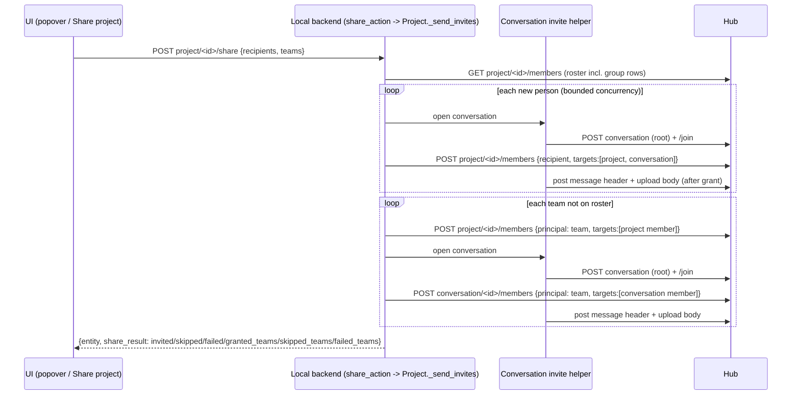

# Team Invites via Hub Group Grant - Plan

**Target repos:** `flowpad` (client, branch `FLOWPAD-2168`, PR #498) and `flowpad-hub` (hub, a new branch from `origin/release/v0.29`). Paths are repo-relative. A `flowpad-hub/` prefix marks hub files; everything else is in `flowpad`.

---

## Goal Capsule

- **Objective:** When a project editor shares a published project with a team, every member of that team, now and later, can open the project and its agents. Each member also sees one invite conversation carrying an Install project chip.
- **Means:**
  - The team is granted on the hub as a single principal (KTD1).
  - The hub keeps `is_final` only on organization targets (KTD2).
  - The client, not the hub, writes the invite message (KTD3).
- **Authority:** the user's decisions in this plan's Key Decisions and session-settled KTDs win. The hub's `CLAUDE.md` (security code needs explicit approval; KTD2 has it) and the client's `CLAUDE.md` (DataSpec shapes, no timeout increases, no backend URLs in the UI) bind every unit.
- **Stop conditions:** stop and ask if any of these happens:
  - A unit would change a hub security path other than KTD2.
  - A unit would add a team-side authorization check.
  - A unit would touch the re-role path.
  - A unit would change the hub API request or response models.
- **Execution profile:** two PRs.
  - Hub: U1 and U2, a small security change with API tests.
  - Client: U3 to U9, the bulk.
  - **Deploy order:** a client build that sends team grants (U5 to U7) must not be released against a hub until U1 is deployed on that hub.
    - Before U1, team edges are final, so team members can read neither the project's children nor the team conversation's messages. Messages are graph children of their conversation (`Conversation.add_message` calls `add_child`).
    - KTD6 skips teams already on the roster, so edges written in that window would never heal.
- **Coordination:** the other session committed its FLOWPAD-2168 work as `5fd596a86` and `b17510cbb` (local, not pushed). Work on top of `b17510cbb`, re-run `npm run i18n:extract` before committing `.po` files, and stage only by explicit path.
- **Finish and ship:** the implementing agent opens or updates the PRs. Closing hub PR #1158 needs the user's go at the time.

---

## Product Contract

### Summary

A team invite becomes one hub group grant on the project instead of per-member invites, and team members reach the project's children. The invite message moves from the hub to the client:
- **Picked people:** each gets a 1:1 conversation.
- **Teams:** each gets one conversation granted to the whole team.

Both team entry points switch: the members popover and the People & teams "Share project" action.

### Problem Frame

Today the client expands a team into its members and sends each one a direct person invite. That has three problems:
- **Only team admins can do it.** Listing a team is admin- or owner-only, so an editor who isn't a team admin gets "you can't see its member list".
- **Membership doesn't follow the team.** People who join later get nothing, and people who leave keep their direct role.
- **The hub edge stops at the project.** The group grant marks every edge `is_final` (FLOWPAD-2126), so a team granted onto a project would reach the project row but not its agents or deployments. On prod, projects hold agents, deployments and service endpoints as children.

### Requirements

**Team grant**
- R1. Sharing a project with a team writes one team → project group grant with role `member`. It never writes per-member direct roles.
- R2. Any caller allowed to manage the project's members can grant any team. There is no team-side check.
- R3. Granting a team that already holds a role on the project creates no second grant, conversation or message.

**Finality**
- R4. A group grant edge is `is_final` only when its target is an organization. Every other target gets a non-final edge, so the team's members inherit into the target's children.
- R5. A team member still cannot reach a sibling team through an organization the team was granted into (FLOWPAD-2126 unchanged).

**Invite messages**
- R6. Each picked person gets a new root-level 1:1 conversation with the sharer. It holds one message with the generic invite line, the sharer's note if given, and a `project-<id>` reference.
- R7. Each granted team gets one new root-level conversation granted to the team, with the same single message. Every current and future team member can read it.
- R8. The invite message reaches receivers in a ready state, so the Install chip never sits in "uploading".

**Roster and entry points**
- R9. The project members popover shows a granted team as one row with its type icon. A caller whose rank allows it can remove that row, which revokes the grant.
- R10. The People & teams "Share project" action uses the same team grant and team conversation as the popover.
- R11. The share result reports per-team outcomes, and it no longer reports "skipped, can't list". Each team is one of:
  - granted, with its conversation, or with none if the message couldn't be sent;
  - skipped because it already has access;
  - failed, with the hub's status and message.

### Key Decisions

- **Team invites use the hub group grant.** (session-settled: user-directed — chosen over per-member expansion into direct roles: membership should follow the team.) Governs R1, R3.
- **No team-side authorization.** (session-settled: user-directed — chosen over requiring team admin/owner: letting editors grant strangers access is the point, and it's out of this PR's scope.) Governs R2.
- **`is_final` only for organization targets.** (session-settled: user-directed — chosen over leaving it always on, and over "org or team": nested teams are out of scope.) Governs R4, R5.
- **Invite messages move to the client.** (session-settled: user-approved — chosen over keeping the hub's `notify_by_message`: no hub API change; hub PR #1158 gets closed.) Governs R6, R7, R8.
- **One conversation per team, granted to the team.** (session-settled: user-directed — chosen over best-effort per-member 1:1s, which only team admins could send, and over no team message.) Governs R7.
- **Both team entry points switch.** (session-settled: user-directed — chosen over popover-only.) Governs R10.

### Scope Boundaries

- The re-role path is out: `PUT change_role` → `replace_role` already rewrites a team → org edge as non-final. Per the user, it gets no ticket and no fix here.
- Nested teams are out.
  - A team granted into a parent team gets a non-final edge, so its members can walk into the parent's child teams (the FLOWPAD-2126 shape, one level down).
  - The shipped "New sub-team" flow (`ui/src/components/organization/create-child-team.ts`) writes exactly that sub-team → parent-team grant. After U1, members of one sub-team reach projects granted to a sibling sub-team through ordinary product use.
- A team granted `guest` is out. Today it's capped only by the blanket `is_final`. After R4, a team granted `guest` on a workspace or group task reaches the contents. The UI only grants `member`, so this is reachable only through the API.
- No team-side authorization (pentest G1 stays deferred) and no hidden-team filter on the roster (G2).
- No data migration.
  - Final team → project edges written since 8fe2106d8 stay final until the team is removed and re-added, or re-granted through the API (upsert). The client skips teams already on the roster (KTD6).
  - This holds only because of the deploy order in the Goal Capsule: the app never sent `principal` before U1, so there are few or none.
- The Share dialog (share-to-conversation), permission-based filtering of team suggestions, and FLOWPAD-2174 stay out, as in `HANDOFF.md`. Treating a team already on the roster as picked (U6) is in scope.

---

## Planning Contract

### Key Technical Decisions

- KTD1. **The client sends the team grant from the Python share orchestration.** `Project._send_invites` posts `{principal: "team-<id>", invitation_targets: [{project-<id>, member}]}` to the hub itself. There is one caller and one result (R11); the UI never calls `APIEntity.addGroupMember` for projects. (session-settled: user-directed — the group grant replaces the expansion; see Key Decisions.)
- KTD2. **Finality is decided per target, inside the grant loop.** In `_grant_group_membership`, just before `grant_role`, the edge is final when that target is an organization. `grant_role` keeps its `is_final_role=False` default. One request with an org and a project target finalizes only the org edge. (session-settled: user-directed — chosen over always final, per the user's instruction: a flag that defaults to False, set True when the entity is an org.)
- KTD3. **The invite conversation is built by a `Conversation` helper, not inside `Project`.**
  - The helper creates a root-level hub conversation and has the sender `/join` it.
  - It lets the caller grant the recipient: the person path adds the conversation as a second `invitation_target` on the project invite; the team path grants the conversation to the team as principal.
  - After the grant it posts the message.
  - `tests/unit/test_project_share_identity.py` fails if `Project._send_invites` source contains `/join`, which is why this lives on `Conversation`.
- KTD4. **The message goes through the full local send pipeline: header, then body upload.** The hub stamps any client-sent `type_id` attachment `uploading` (`flowpad-hub/flowpad/hub/builtin/conversation.py`, `_attachments_require_body`), and receivers wait for READY. A bare `add_message` would leave the chip stuck (R8).
  - The helper creates local Conversation and FlowMessage rows, sends the header, checks its boolean result, then calls `fm.upload_body()` directly.
  - It doesn't use `_upload_body_and_finalize`, which only logs failures, so a header or upload failure reaches the caller.
  - It runs after the grant, mirroring the hub: an auto-accepted invitee is a member by then and gets the message live.
- KTD5. **The message text matches the hub's.** It's `I invited you to project "<name>".`, then the note after a blank line when given. It isn't localized, same as the hub string it replaces. The UI still sends no note; adding a note field is out of scope.
- KTD6. **Teams already on the roster are skipped.** `_hub_roster_statuses` learns the group rows (the `type` is team or organization, keyed by `id`). A team already granted is reported in `skipped_teams` as `already_granted` and gets no new conversation (R3).
  - The hub roster lists people who inherit through a team as ordinary `type: user` rows. A picked person already covered by a team is therefore skipped as `already_member`.
- KTD7. **The result shape.**
  - `ShareResultSpec` gains `granted_teams` (team, name, conversation_id or null) and `failed_teams` (team, status, message).
  - `skipped_teams` is narrowed to one reason, `already_granted` (team, name, reason). The `not_listable` and `no_members` reasons and the "can't see its member list" copy are removed. PR #498 isn't merged, so no released client reads them.
  - `ShareInvitedSpec.conversation_id` is filled from the conversation the client created.
  - `inviteFailure` changes rule. It returns an error only when nothing succeeded (no invited person and no granted team) and at least one person or team failed. Today it errors on any failed person, so a partial person failure is no longer thrown. U6 renders per-person failures from the result instead.

### High-Level Technical Design

Share with a person and a team, after this plan:

The team → conversation edge relies on KTD2 as well. Messages are graph children of their conversation (`Conversation.add_message` calls `add_child`). Before U1, a final team edge stops team members from reading them; that's why the Goal Capsule sets a deploy order. U8 runs against a hub that includes U1.

### Risks & Dependencies

| Risk | Mitigation |
|---|---|
| A team member's client gets no live push for the grant or the team conversation. The group branch emits no websocket frame. | The message fan-out reaches conversation members, including transitive group grants (`flowpad-hub/docs/pentesting/attack-surface.md` §12), and pull is the correctness path. U8 proves arrival end to end. |
| Manual accept of a project + conversation invitation may not `/join` the conversation, because `handle_invitation_accept` joins only when the accept reply names the conversation. | Same two-target invitation the hub builds today, so behavior is unchanged. U8 covers the person path with auto-accept. The manual-accept path is noted for execution-time checking. |
| The bundle upload writes the sender's project JSON into `entities.json`, and the receiver may overlay it onto its own Project row. | Same as any project reference sent through the pipeline today. U4 checks the overlay leaves an installed project unchanged. |
| A team member has no invitation, so their client may have no local Project row. The chip's install state (`useLocalProject`) needs one. | U9 materializes the referenced project on the receiver when it's missing. |
| The team is granted but its conversation or message fails. Members get access with no chip, and a re-share skips the team (KTD6). | The result reports granted with no conversation id, and the UI warns (U6, U7). Recovery is to remove the team and share again. |
| If the roster read fails, `_hub_roster_statuses` returns an empty map. Everyone gets re-invited, and already-granted teams get a second conversation. The hub's own skip went away with `notify_by_message`. | Pre-existing fallback. Accepted for this PR. |
| The hub roster lists people who inherit through the team as `type: user` rows, and the client can't tell them from direct members. | Open decision: see Open Questions. |
| Existing team → org edges written before 8fe2106d8, and any edge re-roled since, are non-final. | Pre-existing and unchanged. Out of scope. |

### Open Questions

- **Inherited user rows in the members popover.** Blocks U6 only; the other units can proceed. The popover would offer remove and role change on each inherited person, but a DELETE for that person can't revoke access that comes through the team edge. The client can't tell inherited people from direct members without new hub data, and adding that data would change a hub response model (a stop condition). Options:
  - Hide remove and role change on user rows whenever a team row is present.
  - Keep them, and show the hub's error when a removal fails.
  - Approve a hub roster provenance field (an exception to the stop condition).

---

## Implementation Units

### U1. Group grant finality by target type (hub)

**Goal:** team and org grants are final only on organization targets.

**Requirements:** R4, R5; KTD2.

**Dependencies:** none.

**Files:**
- `flowpad-hub/flowpad/hub/app/actions/membership/services.py`
- `flowpad-hub/flowpad/hub/tests/api/test_group_membership.py`

**Approach:**
1. In `_grant_group_membership`'s per-target loop, compute the flag from `target_entity.type == BuiltinEntityType.ORGANIZATION.value` (already imported) and pass it to `grant_role`.
2. Rewrite the docstring paragraph about `is_final_role=True`: it now applies to organization targets only, and a resource target is an ordinary membership edge whose people inherit into its children.
3. Add section M ("Finality by target type") to the module's lettered test plan.

**Patterns to follow:** the `_grant_group`, `_new_org`, `_new_team` and `_role_edges_from` helpers in `test_group_membership.py`. Pure-function tests, no mocks, `resp.text` as the assert message.

**Test scenarios:**
- Grant team A (with charlie as a member) onto an org that contains team B. The edge is `is_final`, charlie resolves a role on the org, charlie resolves none on team B, and GET team B as charlie is refused.
- Grant a team onto a project that has an Agent child. The edge is not final, and a team member can GET the agent. Use an Agent or Conversation child: deployments have no `member` role.
- Grant a team onto a conversation that has a message. A team member can read the conversation's messages.
- One request names an org and a project. Only the org edge is final.
- A final team → project edge written by hand (today's shape) becomes non-final after the grant is POSTed again (upsert).
- Existing sections A-L still pass unchanged.

**Verification:** section M passes and the rest of `test_group_membership.py` stays green against a throwaway Neo4j.

### U2. Hub docs for finality (hub)

**Goal:** the docs say which grants are final and why.

**Requirements:** R4, R5.

**Dependencies:** U1.

**Files:**
- `flowpad-hub/docs/access-model.md`
- `flowpad-hub/docs/pentesting/attack-surface.md`

**Approach:**
- `access-model.md`: add a short paragraph next to "Child access": final grants are guest on a workspace or group task (person path) and group grants onto an organization. Everything else inherits.
- `attack-surface.md`: refresh the §17 citations that point into `services.py`, and note the group-grant finality rule.

**Test expectation:** none — documentation only.

**Verification:** the cited lines match the U1 code.

### U3. Share result shape for team outcomes (client)

**Goal:** a DataSpec and TS shape that report team grants.

**Requirements:** R11; KTD7.

**Dependencies:** none.

**Files:**
- `flow_sdk/schema/data_spec/share_result_spec.py`
- `flow_sdk/schema/data_spec/share_request_spec.py` (docstrings only)
- `ts_sdk/src/entities/members.ts`
- `ts_sdk/src/entities/project.ts` (`inviteFailure`)
- `tests/unit/test_share_result_spec.py` (new, or extend an existing spec test)

**Approach:**
1. Add frozen `ShareGrantedTeamSpec` (conversation_id may be null) and `ShareFailedTeamSpec`, plus `granted_teams` and `failed_teams` on `ShareResultSpec`.
2. Narrow `ShareSkippedTeamSpec.reason` to `already_granted`.
3. Mirror the shape by hand in `members.ts`, keeping snake_case names.
4. Change `inviteFailure` to the KTD7 rule.
5. Update the "expanded at send time" docstrings.

**Patterns to follow:** the existing frozen specs in `share_result_spec.py`; the `members.ts` header contract.

**Test scenarios:**
- A result with one granted team, one skipped (`already_granted`) team and one failed team round-trips through `model_dump` and validation.
- An unknown key is rejected (`extra="forbid"`). A skipped-team reason other than `already_granted` is rejected.
- `inviteFailure` returns null when a team was granted and every person failed.
- `inviteFailure` returns null when one person was invited and another failed.
- `inviteFailure` returns an error when every person and every team failed.

**Verification:** spec tests and the TS type checks pass.

### U4. Conversation invite helper (client)

**Goal:** one helper that opens a root-level invite conversation, lets the caller grant it, then posts a ready message.

**Requirements:** R6, R7, R8; KTD3, KTD4, KTD5.

**Dependencies:** none.

**Files:**
- `flow_sdk/builtin/conversation.py`
- `tests/unit/test_conversation_invite_helper.py` (new)

**Approach:**
1. Create the local Conversation row (titled after the project) and publish it root-level with `/join`, the same calls as the `Conversation.share()` prefix.
2. Hand the conversation typeid back to the caller, which performs the grant.
3. After the grant, create the local FlowMessage (KTD5 text plus a `project-<id>` reference) and send it as KTD4 says: header, check its result, then `fm.upload_body()`.
4. Split the helper into "open" and "post", so the caller's grant sits between them and the order follows KTD4.
5. Add a "discard" step that deletes the just-opened conversation, both the hub row as owner and the local row. U5 uses it when the grant fails.

**Patterns to follow:**
- `Conversation.share()` and `deliver_pending_messages` in `flow_sdk/builtin/conversation.py`.
- `_finalize_message_dispatch` in `flow_sdk/app/actions/notification_action.py`.
- The recording `_Hub` fixture in `tests/unit/test_project_share_invite_message.py`, which stubs only `FlowpadClient.request`.

**Test scenarios:**
- Open-then-post issues, in order: conversation create, `/join`, then the message header, then the body upload.
- The create has no parent, so it's root-level.
- The posted message carries the `project-<id>` reference and the KTD5 text.
- With a note, the text ends with a blank line and then the note. Without one, it's the generic line only.
- After posting, the local message row is READY and remote.
- If the header POST or the body upload fails, the error surfaces to the caller. There's no retry loop and no timeout change.
- Discard removes the conversation on the hub and locally.
- An installed receiver-side project's row is unchanged by the bundle's entities overlay.

**Verification:** the new tests pass. `test_share_delivers_pending_messages.py` is still green.

### U5. `_send_invites` rewrite: person conversations and team grants (client)

**Goal:** the share orchestration uses group grants for teams and client-built conversations for everyone.

**Requirements:** R1, R3, R6, R7, R11; KTD1, KTD3, KTD6, KTD7.

**Dependencies:** U3, U4.

**Files:**
- `flow_sdk/builtin/project.py`
- `tests/unit/test_project_share_invite_message.py` (rewrite)
- `tests/unit/test_project_share_identity.py`
- `tests/unit/test_project_share_invite_by_user_id.py`
- `tests/unit/test_project_share_invite_role.py`

**Approach:**
1. Delete `_expand_share_teams` and the team half of `_merge_share_people`.
2. `_hub_roster_statuses` also returns the set of granted group ids (KTD6).
3. **Each new person:** open a conversation (U4), post the project invite with the conversation as a second `member` target and no `notify_by_message`, then post the message. `conversation_id` comes from the helper. Keep the `_SHARE_INVITE_CONCURRENCY` bound.
   - If opening the conversation fails, the person goes to `failed` and no project invite is sent.
   - If the project invite fails, discard the conversation (U4) and record the person in `failed`.
   - If the invite succeeds but posting the message fails, the person is still in `invited` with the conversation id.
4. **Each team not already on the roster:**
   - post the group grant on the project;
   - if that succeeds, open a conversation;
   - grant it to the team as principal;
   - post the message.
   - A failed grant goes to `failed_teams`. A failure after the grant still reports the team in `granted_teams`, with no conversation id.
5. Drop the `skip_reason` branch from `_share_outcome`.

**Execution note:** rewrite the invite-message tests first against the new wire sequence, then change the code.

**Patterns to follow:** the current `_send_invites` structure (merge, roster, skip, bounded gather) and the `ShareResultSpec` assembly.

**Test scenarios:**
- One person and one team produce these requests: one person project invite with targets `[project, conversation]` and no `notify_by_message`; one group grant `{principal: team-<id>}` on the project; one conversation group grant to the team. There are no `GET team/<id>/members` calls.
- A team already present as a group row on the roster produces no requests and is reported in `skipped_teams` as `already_granted`.
- A group grant that returns 403 produces `failed_teams` with status 403. That team gets no conversation.
- A person invite that returns 403 produces `failed` with status 403, and the conversation opened for it is discarded.
- A person whose invite succeeds but whose message post fails is in `invited` with the conversation id.
- A group grant that succeeds but whose conversation create fails still reports the team in `granted_teams` with no conversation id.
- Person dedup is unchanged: self, `already_member` and `already_invited` are still skipped by user id or email.
- Every `invited[]` entry carries the conversation id the client created.
- `inspect.getsource(Project._send_invites)` still contains no `/join`.

**Verification:** the rewritten and adjacent share tests pass.

### U6. Members popover: team rows and team outcomes (client UI)

**Goal:** the popover shows granted teams and reports team outcomes.

**Requirements:** R9, R11.

**Dependencies:** U3, U5. The inherited-user-rows Open Question must be answered first.

**Files:**
- `ui/src/components/conversation/MembersAvatarStack.tsx`
- `ui/src/hooks/use-members.ts`
- `ui/src/components/contact-picker/use-team-suggestions.ts`
- `ui/src/locales/{en-US,he,ar}/messages.po`
- `ui/tests/unit/members-invite-teams.test.tsx`

**Approach:**
1. Reuse `isGroupMember` and `memberPrincipalId` from `ui/src/components/organization/member-list.tsx`:
   - key the rows by principal id;
   - render the icon through `iconForType`;
   - gate the remove action with the group-aware rank check.
2. Show a granted team's role as a locked label, like the pending team chip. There's no role selector, because re-roling a team is out of scope.
3. Removing a team calls the existing `removeMember(teamId)`.
4. A team already on the roster counts as picked.
5. Replace the skipped-team copy with copy for each outcome, in all three locales:
   - failed team;
   - skipped as `already_granted`;
   - granted with no conversation id: the warning "{team} now has access, but the invite message wasn't sent."
6. Render every `failed[]` person (name and hub message) from the result, since `inviteFailure` no longer throws on partial failure (KTD7).

**Execution note:** the Team label is already committed in `5fd596a86`; build on it. Re-run `npm run i18n:extract` before committing `.po` files.

**Test scenarios:**
- A roster with a team row renders one row labeled with the team name, the team icon and a locked role.
- No caller rank sees a role selector on it.
- A caller ranked above the team's role sees a remove action on the team row. Clicking it sends DELETE members with the team id.
- A caller at or below that rank sees no remove action.
- A team already on the roster isn't offered as a new suggestion.
- A result with one failed team shows the failed copy with the team name.
- A granted team with a conversation id shows no error. A granted team with no conversation id shows the warning.
- A skipped `already_granted` team shows the already-has-access copy.
- One of two people fails and no teams are involved: the popover shows that person's failure.

**Verification:** `members-invite-teams.test.tsx` and the adjacent popover tests pass.

### U7. People & teams "Share project" uses the team grant (client UI)

**Goal:** the second team entry point goes through the same path.

**Requirements:** R10.

**Dependencies:** U5.

**Files:**
- `ui/src/components/organization/budgets/ShareProjectPanel.tsx`
- `ui/src/components/organization/budgets/team-recipients.ts` (remove it if nothing else imports it)
- `ui/src/locales/{en-US,he,ar}/messages.po`
- `ui/tests/unit/share-project-to-team.test.tsx`

**Approach:**
1. Replace the `collectTeamRecipients` email expansion with `project.invite([], { teams: [teamTypeId] })`. The backend's `share_entity` already publishes first when the project has no hub row.
2. The dialog drops the roster-driven lines: the "Reading this team's people" spinner, the recipient count, the no-email line and the roster-read error. Keep the description copy.
3. The confirm button is enabled once the project row has loaded; keep the sharing and connecting guards.
4. Toasts:
   - success when the team is in `granted_teams` with a conversation id;
   - the no-message warning (U6 copy) when it's granted without one;
   - "{team} already has access to {project}." when it comes back in `skipped_teams`;
   - the hub's message from `failed_teams` in the error toast.

**Test scenarios:**
- Sharing a project with a team sends one share action whose `teams` holds the team typeid and whose `recipients` is empty.
- It makes no member-list reads.
- The dialog opens with the confirm button enabled and no "Reading this team's people" line.
- A failed team outcome shows the error toast with the hub's message.
- A granted outcome with a conversation shows success. One without a conversation shows the warning.
- A skipped `already_granted` outcome shows the already-has-access toast.

**Verification:** `share-project-to-team.test.tsx` passes with its new assertions.

### U8. End-to-end: person and team invites (client)

**Goal:** prove delivery and access across real instances.

**Requirements:** R1, R6, R7, R8, R9; the U1 dependency for child access.

**Dependencies:** U5, U6, U9. The team case needs a local hub running U1.

**Files:**
- `ui/tests/e2e/project-invite-members/project_invite_members.spec.ts`
- `ui/tests/hub/course_project_share_two_client.ui.test.ts`

**Approach:**
- Keep the existing person flows. They now read `invited[].conversation_id` from the client-built conversation.
- Add a team case: a team containing the member instance is shared from the editor instance, and the member sees the team conversation with the Install project chip, installs, and can open an agent under the project.

**Test scenarios:**
- A person invite: the invitee's invite conversation shows the chip, and install succeeds.
- A team invite: a team member (not a team admin) sees exactly one team conversation with the chip, and after install can read the project's agent.
- A team invite by an editor who isn't a team admin succeeds, with no "can't see its member list" message.
- Removing the team row from the popover revokes the member's access to the project.

**Verification:** both specs pass on the docker dev-users rig against the local hub.

### U9. Receiver materializes a referenced project it doesn't have (client)

**Goal:** a team member who got access only through the team can install from the chip.

**Requirements:** R7; the Objective's Install chip.

**Dependencies:** none. U8 exercises it.

**Files:**
- `flow_sdk/builtin/flow_message.py`, or the receive-side message sync that materializes entities
- `tests/unit/test_receive_project_reference_materializes.py` (new)

**Approach:**
- The chip's install state (`useLocalProject`) needs a local Project row. A team member has no invitation, and a group grant emits no websocket frame, so nothing creates that row.
- When a received message references `project-<id>` and no local Project row exists, the receiving client GETs `/graph/project/<id>` from the hub and mirrors it with `materialize_remote_membership_entity`, as `compute_node.py` already does.

**Execution note:** first confirm the gap on the receiver: check whether the chip's `entityRow` already resolves through hub reflection. If it does, keep only the test.

**Test scenarios:**
- A received message references a project with no local row. After sync, a local remote Project row exists with the hub's name and origin.
- A received message references a project the receiver already has. The existing row isn't overwritten.
- If the hub GET returns 403 or 404, no row is created and the chip shows unavailable.

**Verification:** the new test passes, and U8's team case reaches the install state with no invitation.

---

## Verification Contract

| Scope | Command / gate | Applies to |
|---|---|---|
| Hub API | `cd flowpad-hub/flowpad/hub/tests && uv run pytest -v api/test_group_membership.py`, against a throwaway Neo4j (see `HANDOFF.md`) | U1 |
| Hub lint | `uv run ruff check --fix` on changed files | U1 |
| Client Python | `uv run pytest tests/unit/test_project_share_*.py tests/unit/test_share_*.py tests/unit/test_conversation_invite_helper.py tests/unit/test_receive_project_reference_materializes.py`, with `DEPLOY_ENV` unset and the appdirs plugin from `HANDOFF.md` | U3, U4, U5, U9 |
| Client TS / UI | the vitest unit tier for the touched tests, using the `ts_sdk/node_modules` junction steps from `HANDOFF.md` | U3, U6, U7 |
| E2E | Playwright `project-invite-members` plus the hub two-client test on the docker dev-users rig | U8 |
| Rules | no raised timeouts or retries; every new shape is a DataSpec; `.po` catalogs updated in all three locales | all |

---

## Definition of Done

- Every unit's verification passes.
- Hub PR against `release/v0.29` contains U1 and U2 only.
- Client PR #498 contains U3 to U9 and no longer sends `notify_by_message`.
- No client build with U5 to U7 is released against a hub that doesn't yet run U1.
- Hub PR #1158 is closed after the user confirms.
- No per-member expansion code remains: `_expand_share_teams`, `collectTeamRecipients` if unused, and the `not_listable` / `no_members` skip reasons.
- No abandoned-attempt code is left in either diff.
- Only this work's files are staged, each by explicit path.
