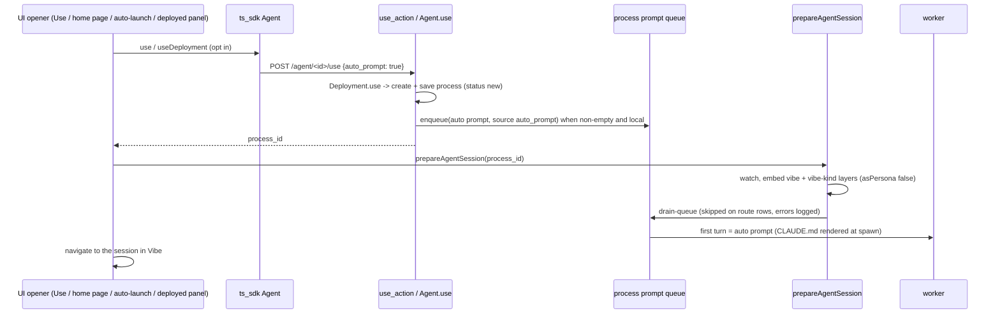

# Agent Auto Prompt on Every Session - Plan

## Goal Capsule

- **Objective:** Every time a person opens a new local chat session with an agent from Flowpad, the agent's auto prompt runs as that session's first turn — not only the one time the project auto-launches it — and one-shot runs, remote placements, and resumed chats behave exactly as before.
- **Means:** The backend queues the auto prompt when a session is opened on an explicit opt-in (KTD1, KTD2), and the UI's session-setup step sends it once the vibe layers are embedded (KTD4).
- **Authority:** Requirements (R-IDs) win on product behavior; KTDs win on mechanism within them; units override neither. `docs/breadcrumbs/agent_session_persona.md` invariants stay binding (vibe embeds as a layer, Use and auto-launch share one prepare path).
- **Stop conditions:** Stop and ask if implementation shows the hub injects its own flags into the relayed `use` body (breaks KTD2), or if sending the prompt before the vibe embed is the only way to make a path work.
- **Execution profile:** Backend first (U1), then TS SDK (U2), then UI (U3, U4, U5), docs last (U6). Ticket FLOWPAD-2180, branch `FLOWPAD-2180` off `release/v0.2`.
- **Finisher:** The implementing agent lands all units and runs the Verification Contract, including the running-app on/off check; the user reviews and ships.

---

## Product Contract

### Summary

Decouple the agent's auto prompt from project auto-launch. Any new local session opened as the agent from the Flowpad UI gets the auto prompt as turn 1, programmatic callers get it only on request, and the agent editor shows "Auto prompt" as its own setting beside the auto-launch switch.

### Problem Frame

An agent's `auto_launch_prompt` is queued only inside `Agent.auto_launch_for` (`flow_sdk/builtin/agent.py`), the once-per-project auto-launch. Every other way of opening a session as the agent — the Use button, the agent home page, the deployed-agent panel — opens an empty session, so an agent designed to start a conversation (a tutor opening a lesson, an assistant greeting with a task) only does so once per project per machine. The editor reinforces the coupling by hiding the prompt field unless auto-launch is on.

The on/off switch was proven on this branch: moving the enqueue into `Agent.use()` made two consecutive Use sessions each queue the prompt; reverting it left both queues empty. A second link matters too: `PromptQueue.enqueue` does not start a drain, and today only the auto-launch redirect sends the `drain-queue` kick after the vibe embed.

### Requirements

**Session behavior**

- R1. A new local session opened as an agent from the Flowpad UI — Use button, agent home page (new chat), project auto-launch, deployed-agent panel on a local placement — runs the agent's non-empty auto prompt as its first turn.
- R2. Each new session gets the prompt exactly once; auto-launch never queues it twice.
- R3. An agent whose auto prompt is empty or whitespace opens a session with no first turn.
- R4. Resuming an existing chat never re-sends the auto prompt.
- R5. One-shot runs — run/launch, schedules, triggers, email/WhatsApp message processing, task dispatch — never receive the auto prompt.
- R6. Remote placements are unchanged: opening one never queues the auto prompt on the placement machine.
- R7. Programmatic callers (Python `Agent.use`, TS SDK `use` / `useDeployment`) get the auto prompt only when they explicitly ask for it.
- R8. A failure to send the auto prompt never reports the session as failed to open.

**Auto-launch**

- R9. Auto-launch keeps its once-per-project selection, marking, status, and reset; it no longer owns the prompt.

**Agent editor**

- R10. The agent editor shows "Auto prompt" as an always-visible field, edited and saved independently of the auto-launch switch.
- R11. The auto-launch switch keeps its once-per-project help text, launched status, and reset.

**Documentation**

- R12. Docs, SDK docstrings, and the agent-builder skill describe the auto prompt as sent on every new session, independent of auto-launch.

### Key Decisions

- **The auto prompt is per-session, not per-auto-launch.** The current once-per-project behavior is intended for launching; the prompt moves off it. (session-settled: user-directed — chosen over keeping the prompt tied to auto-launch: the ticket question became where to move the prompt logic, not whether.) Governs R1, R2, R9.
- **One-shot runs are excluded.** (session-settled: user-directed — chosen over giving runs the auto prompt too: a run brings its own prompt, and queueing the auto prompt would give it a second turn.) Governs R5.
- **Remote placements are out of scope.** (session-settled: user-directed — chosen over making remote sessions send the prompt: remote auto prompt is explicitly out of scope for this ticket.) Governs R6.
- **Programmatic callers opt in.** (session-settled: user-directed — chosen over always queueing on local sessions and over defaulting Python callers on: always-queue strands the prompt on remote placement machines and gives SDK scripts a surprise turn after their own.) Governs R6, R7.
- **Auto prompt is its own editor setting.** (session-settled: user-directed — chosen over keeping the prompt field nested under the auto-launch switch: the resource panel must reflect the decoupling.) Governs R10, R11.

### Scope Boundaries

- Remote placements (hub `use`, adopted route rows) do not get the auto prompt; making them work would need `drain-queue` relayed to the placement machine, which `tests/unit/test_remote_route_relay.py` deliberately refuses today.
- One-shot run paths are untouched; `tests/unit/agent/test_agent_run_skips_auto_prompt.py` guards them.
- The stored key stays `auto_launch_prompt` (KTD6); no agent.json migration.

#### Deferred to Follow-Up Work

- Turn-order guarantee when the drain is late or lost: make the composer enqueue (not prompt) while the queue already holds entries, so a message typed before the auto prompt starts lands after it.
- Draining a stranded never-started chat when the home page resumes it.
- Backend-owned vibe embed plus drain inside `Agent.use()`, removing the UI's role in sending the prompt, if more non-UI callers of `use()` appear.

---

## Planning Contract

### Key Technical Decisions

- KTD1. **Queue the auto prompt in `Agent.use()`, after the session is saved.** `Agent.use()` is the one convergence point for every local session opener (Use, home page, auto-launch, deployed panel, Python); `auto_launch_for` stops enqueueing and reports `prompt_queued` from what `use()` did. This also fixes today's stale-prompt read: `auto_launch_for` enqueued `winner.auto_launch_prompt` from the un-refreshed row while the process came from `winner.fresh()`. (session-settled: user-approved — chosen over enqueueing per route or in the frontend: every local opener was verified to reach `Agent.use()`.) Covers R1, R2.
- KTD2. **Opt-in `auto_prompt` flag, default off, honored only on a deployment local to the calling tier.** `Agent.use(..., auto_prompt=False)`; `use_action` reads `auto_prompt` from the request body; `auto_launch_for` passes `True`; `Deployment._use_on_hub` builds the hub body itself and never carries the flag, so a relayed `use` arriving at the placement machine's `use_action` has no flag and queues nothing even though that deployment is local there. A "no `deployment_id` in the body" gate was rejected: the deployed panel sends `deployment_id` for local placements too. (session-settled: user-directed — chosen over always queueing when `target.is_local`: the placement machine sees its deployment as local, queues the prompt, and the originating tier's `drain-queue` is refused on the route row.) Opting in only queues the prompt; a programmatic caller sends it by starting the drain before its own first turn — Python `process.submit()` (no argument drains the head; `submit(text)` queues `text` behind it), TS `drainQueue()` or `prepareAgentSession`. Python `prompt()` bypasses the queue, so calling it first makes the auto prompt run second. Covers R6, R7.
- KTD3. **Queue directly, never through the `enqueue` action.** Enqueue via `process.queue.enqueue(...)` as `auto_launch_for` does today; the HTTP `enqueue` action also schedules a drain, which on a cold headless session would run turn 1 before the vibe layer is embedded.
- KTD4. **`prepareAgentSession` sends the queued prompt after the vibe embed.** It ends with the `drain-queue` kick — the "session configured, start" signal — and the auto-launch redirect drops its own kick. All three existing callers already await it before navigating, so the prompt is running before the pane opens. (session-settled: user-directed — chosen over backend-owned vibe embed plus drain: smallest change, and it keeps the breadcrumb invariant that Use and auto-launch share one prepare path.) Covers R1.
- KTD5. **The drain inside `prepareAgentSession` never throws.** Failures are logged; route rows (`hub_route`) skip the drain; when `getById` returns null the drain is still attempted by process id. `useAgentLauncher.launch` wraps `prepareAgentSession` in the try that raises the "Could not use" toast, so a thrown drain would report a session that did open. Covers R8.
- KTD6. **Keep the stored key `auto_launch_prompt`; relabel only the UI.** `AgentSpec` forbids unknown keys (`flow_sdk/schema/data_spec/agent_spec.py`), so a rename breaks every existing agent.json without an alias. Covers R10.
- KTD7. **Queue-entry source becomes `auto_prompt`.** Nothing outside tests reads the `auto_launch` source label; the new label names the feature, not the launcher.
- KTD8. **TS SDK `use()` / `useDeployment()` take an opt-in option, default off; the UI's three openers and the deployed panel (local placements) pass it.** External SDK pages (`examples/deployed-agent-chat/index.html`) keep today's behavior and never get a prompt they don't drain. Covers R7.
- KTD9. **`DeployedAgentChatPanel.openSession` branches on placement locality.** A local placement (and never in hub-only mode) calls `useDeployment` with the opt-in, awaits `prepareAgentSession`, then opens in Vibe, matching the other openers. A remote placement keeps today's path unchanged — `useDeployment` without the opt-in, no prepare step, the current `openShellProcess` call — because `load_embedded_subagent_action` has no route-row check and would embed vibe on the adopted route row, and because in hub-only mode the panel's body reaches the hub directly. Covers R1, R6.
- KTD10. **Existing agents that hold a hidden prompt with auto-launch off will start sending it.** Accepted: the field becomes visible (R10), so the owner can see and clear it. Call it out in the PR description.

### High-Level Technical Design

Session open with the auto prompt, local placement:

Whether a `use` queues the prompt:

| Caller | `auto_prompt` sent | Deployment local on the tier handling `use` | Queued |
|---|---|---|---|
| UI opener, local placement | yes | yes | yes |
| UI opener, remote placement (originating tier) | yes | no, `_use_on_hub` relays | no |
| Deployed panel, remote placement | no (KTD9 keeps today's path) | no | no |
| Hub relay arriving at the placement machine | no (hub body built without it) | yes | no |
| `auto_launch_for` | yes (Python arg) | yes | yes |
| Python / TS SDK default | no | any | no |
| One-shot run (`Agent.launch`) | n/a, never calls `use` | any | no |

### System-Wide Impact

- **Agent sessions:** Every UI-opened agent session now starts with a turn, so each session's recents title is derived from the auto prompt, and the agent's intro bubble appears above an auto-sent user turn.
- **Agent-builder skill:** It authors agent.json and quotes editor labels (`references/screens.md`); it must learn the new label and semantics or it will keep telling users the prompt fires once per project.
- **Hub:** No hub change; KTD2 depends on the hub forwarding only the body the desktop built.

### Risks & Dependencies

| Risk | Mitigation |
|---|---|
| Hidden legacy prompts start firing on every session (KTD10) | Field becomes visible; PR description names it. |
| Turn-order inversion when the drain is lost (null process, network, tab closed between use and drain): the prompt runs after the user's first message | KTD5 narrows the window; the full guarantee is deferred follow-up work. |
| The hub forwards extra body keys to the placement machine | Stop condition in the Goal Capsule; `hub_post` body is built on the desktop in `Deployment._use_on_hub`. |
| i18n CI gate fails on changed labels | U5 runs extraction and commits all three catalogs. |

### Sources & Research

- Breadcrumb invariants: `docs/breadcrumbs/agent_session_persona.md` (vibe as layer, one prepare path for Use and auto-launch) and the queue-drain owner rule in `docs/breadcrumbs/pty_queue_drain.md`.
- Drain refusal on route rows: `flow_sdk/builtin/agentic_process/agentic_process.py` `_drain_queue_action`; locked by `tests/unit/test_remote_route_relay.py`.
- Headless start order: `AgenticProcess.submit` drains the queue head on a headless or cold session; `prompt()` bypasses the queue.
- Hub relay body: `flow_sdk/builtin/deployment.py` `_use_on_hub`.
- Composer admission: `ts_sdk/src/process/agentic-process.ts` `promptOrEnqueue` (relevant to the deferred turn-order work).

---

## Implementation Units

### U1. Backend: opt-in auto prompt in `Agent.use()`

**Goal:** `Agent.use()` queues the auto prompt when asked and the deployment is local; `use_action` and `auto_launch_for` opt in; `auto_launch_for` stops queueing on its own.

**Requirements:** R1, R2, R3, R5, R6, R7, R9; KTD1, KTD2, KTD3, KTD7.

**Dependencies:** none.

**Files:**
- `flow_sdk/builtin/agent.py` (`use`, `use_action`, `auto_launch_for`, `auto_launch_prompt` field description)
- `flow_sdk/builtin/deployment.py` (`use` docstring only)
- `flow_sdk/server/routes/agents.py` (docstring only)
- `tests/api/test_agent_use_queues_auto_launch_prompt.py` (adopt; send the flag; drop the added 60 s timeout mark)
- `tests/unit/agent/test_agent_run_skips_auto_prompt.py` (adopt as-is)
- `tests/unit/agent/test_agent_auto_launch_for.py` (update)
- `tests/api/test_agents_auto_launch_route.py` (update)
- `tests/unit/test_remote_route_relay.py` (extend)

**Approach:**
1. `Agent.use()` gains an `auto_prompt` keyword, default off. After `target.use()` returns the saved process, enqueue the stripped prompt when the flag is on, the prompt is non-empty, and `target.is_local` (KTD3 for how).
2. `use_action` reads a boolean `auto_prompt` from the body and passes it through.
3. `auto_launch_for` calls `use(..., auto_prompt=True)` on the refreshed agent, removes its own enqueue, and derives `prompt_queued` from the refreshed agent's prompt.
4. Reword the field description and the "no first turn" docstrings on `Agent.use`, `use_action`, `Deployment.use`, and the auto-launch route. The `Agent.use` docstring states the start order from KTD2: with `auto_prompt=True`, start with `process.submit()` rather than `prompt()`.

**Patterns to follow:** Existing enqueue at the end of `auto_launch_for`; body parsing in `use_action`; api tests via `bootstrapped_client` with `tests/unit/agent/_seed.py`; hub-stub style of `tests/unit/test_remote_route_relay.py`.

**Test scenarios:**
- Two `POST /agent/<id>/use` calls with `auto_prompt: true` each queue exactly the trimmed prompt.
- The same call without the flag queues nothing.
- An agent with a whitespace-only prompt queues nothing even with the flag.
- `auto_launch_for` on a flagged agent leaves exactly one queue entry, sourced `auto_prompt`, and reports `prompt_queued` true.
- `auto_launch_for` after the agent's folder changed queues the refreshed prompt, not the stale one.
- `Deployment.use` on a remote placement sends a hub body with no `auto_prompt` key.
- `use_action` with `{deployment_id}` and no flag, on a deployment that is local to that tier, leaves the queue empty (the placement-machine side of a relay).
- `Agent.use()` itself does not schedule a drain (spy on the drain scheduler).
- `agent.launch("…")` on an agent with an auto prompt sends only its own prompt and leaves the queue empty (existing guard).

**Verification:** New and updated backend tests pass; the adopted api test fails if the enqueue is removed from `Agent.use()` and passes with it.

### U2. TS SDK: opt-in option on `use()` and `useDeployment()`

**Goal:** TS callers can ask for the auto prompt; the default stays off.

**Requirements:** R7; KTD8.

**Dependencies:** U1.

**Files:**
- `ts_sdk/src/entities/agent.ts` (`use`, `useDeployment`, `auto_launch_prompt` doc)
- `ts_sdk/src/process/agentic-process.ts` (`drainQueue` doc)
- `ui/tests/api/agent_use_keeps_agent_persona.test.ts` (extend)

**Approach:**
1. Add an options argument to `use()` and `useDeployment()` carrying the opt-in; send `auto_prompt: true` in the body only when set.
2. Update doc comments: `use()` no longer "no first turn" when opted in, and states the start order from KTD2 (opt in, then `drainQueue()` or `prepareAgentSession`, then the caller's own prompt); `drainQueue()` is the session-ready kick.

**Patterns to follow:** Existing body construction in `Agent.use` / `useDeployment`.

**Test scenarios:**
- Api tier, live backend: an agent with an auto prompt, `agent.use(projectId, { autoPrompt: true })` then `prepareAgentSession` → the queue drains and the session's first user turn is the auto prompt, with CLAUDE.md still free of a vibe persona block.
- Api tier: `agent.use(projectId)` with no option → the queue stays empty after `prepareAgentSession`.

**Verification:** The api-tier persona test and its new cases pass against a disposable instance.

### U3. UI: `prepareAgentSession` sends the queued prompt; openers opt in

**Goal:** The shared prepare step sends the auto prompt after the vibe embed, safely, for the Use button, the agent home page, and project auto-launch.

**Requirements:** R1, R4, R8; KTD4, KTD5.

**Dependencies:** U2.

**Files:**
- `ui/src/components/agents/use-agent-launcher.ts` (`prepareAgentSession`, `useAgentLauncher`, file doc)
- `ui/src/agents/agent-auto-launch-redirect.ts` (remove its own drain)
- `ui/src/project-home-page/project-home-page-redirect.ts` (opt in on the new-chat branch)
- `ui/src/pages/flow-page/use-start-vibe-session.ts` (doc mention only)
- `ui/tests/unit/prepare-agent-session.test.ts` (new)
- `ui/tests/unit/agent-auto-launch-redirect.test.ts` (update)
- `ui/tests/unit/project-home-page-redirect.test.ts` (update)

**Approach:**
1. `prepareAgentSession` ends with the drain kick after `embedVibeSubagent`; errors are caught and logged; route rows skip it; a null `getById` still attempts the drain by id (KTD5).
2. `useAgentLauncher` and the home-page new-chat branch call `use()` with the opt-in.
3. The auto-launch redirect keeps calling `prepareAgentSession` and drops its separate drain.

**Execution note:** Read `docs/breadcrumbs/agent_session_persona.md` before editing; its capsule sits on `ui/tests/api/agent_use_keeps_agent_persona.test.ts`.

**Patterns to follow:** `vi.hoisted` + `vi.mock('@sdk', …)` harness in `ui/tests/unit/agent-auto-launch-redirect.test.ts`, including its embed-before-drain call-order assertion.

**Test scenarios:**
- `prepareAgentSession` embeds vibe before it drains (call order).
- A rejected drain (409 or network) is swallowed: `prepareAgentSession` resolves with the process and logs a warning.
- A route-row process skips the drain.
- `getById` resolving null still issues a drain for the id.
- `useAgentLauncher.launch` navigates and raises no error toast when the drain rejects.
- Home page with no previous chat: `use` is called with the opt-in and the drain runs; home page resuming a chat: no `use`, no embed, no drain.
- Auto-launch redirect: embed then exactly one drain, then redirect into Vibe.

**Verification:** Unit tier green; no drain call remains outside `prepareAgentSession` in `ui/src`.

### U4. UI: deployed-agent panel opens local sessions through the prepare step

**Goal:** "Open a session" on a local placement starts with the auto prompt; remote placements keep today's behavior.

**Requirements:** R1, R6, R8; KTD8, KTD9.

**Dependencies:** U3.

**Files:**
- `ui/src/components/assets/editor/agent-profile/DeployedAgentChatPanel.tsx`
- `ui/tests/react/deployed-agent-chat-panel.test.tsx` (update)

**Approach:**
1. Branch `openSession` on the placement's locality (KTD9).
2. Local placement: call `useDeployment` with the opt-in, await `prepareAgentSession`, then open the process in Vibe.
3. Remote placement, or hub-only mode: keep today's `useDeployment` then `openShellProcess` path, with no opt-in and no prepare step.

**Patterns to follow:** `useAgentLauncher.launch` ordering (use → prepare → navigate).

**Test scenarios:**
- Local placement: `useDeployment` receives the opt-in, then prepare, then navigation to Vibe, in that order.
- Remote placement fixture (`gcp_vm`): `useDeployment` is called without the opt-in, `prepareAgentSession` is not called (no embed, no drain), and `openShellProcess` receives the same arguments as today.

**Verification:** React-tier panel test passes against a disposable instance.

### U5. Agent editor: "Auto prompt" as its own field

**Goal:** The editor shows and saves the auto prompt independently of the auto-launch switch.

**Requirements:** R10, R11; KTD6.

**Dependencies:** none (UI-only; can land alongside U3).

**Files:**
- `ui/src/components/assets/editor/agent-profile/AgentProfileEditor.tsx`
- `ui/src/components/assets/editor/agent-profile/AgentScheduleSection.tsx` (prop rename to reflect "auto prompt")
- `ui/src/components/agent-resources/AgentSchedulesSection.tsx`
- `ui/src/locales/en-US/messages.po`, `ui/src/locales/he/messages.po`, `ui/src/locales/ar/messages.po` (regenerated)
- `ui/tests/unit/agent-profile-document.test.tsx` (extend)
- `ui/tests/unit/agent-schedule-section.test.tsx` (update for the prop rename)

**Approach:**
1. Move the prompt textarea out from under the auto-launch conditional into its own labeled "Auto prompt" block with help text saying it is sent as the first message of every new session.
2. Leave the auto-launch switch, its once-per-project help text, and the launched status/reset block as they are.
3. Add "auto prompt" to the profile summary line; rename the schedule-default prop to match.
4. Regenerate the lingui catalogs.

**Patterns to follow:** `agent-profile-document.test.tsx` fixture (`new Agent`, `FSRef`, spied `readDocument` / `updateDocument`) and its accessible-name queries.

**Test scenarios:**
- With `auto_launch` false, the "Auto prompt" textbox is visible and shows the stored prompt.
- Editing and blurring it commits `auto_launch_prompt` with the trimmed value.
- Toggling auto-launch off does not hide the field; toggling it on does not duplicate it.
- The auto-launch switch still commits `auto_launch`, and the launched status and Reset still render when the agent has launched.

**Verification:** Unit tier green; catalog extraction produces no diff after the catalogs are committed.

### U6. Docs, skill, and breadcrumb

**Goal:** Everything that tells people or agents how the auto prompt works says "every new session".

**Requirements:** R12.

**Dependencies:** U1, U3, U5.

**Files:**
- `docs/agents-management.md`
- `docs/breadcrumbs/agent_session_persona.md`
- `docs/interface/agentic-process.md`
- `docs/modes/vibe_mode.md`
- `docs/snippets/agent-deployment.md`
- `docs/snippets/processes.md`
- `flow_sdk/system_projects/flowpad_assistant/.claude/skills/agent-builder/topics/chat.md`
- `flow_sdk/system_projects/flowpad_assistant/.claude/skills/agent-builder/references/agent-json.md`
- `flow_sdk/system_projects/flowpad_assistant/.claude/skills/agent-builder/references/screens.md`
- `flow_sdk/system_projects/flowpad_assistant/.claude/skills/agent-builder/references/validation-loop.md`

**Approach:**
1. Rewrite the field table and auto-launch paragraph in `docs/agents-management.md`, including the stale note on when the once-only mark is written.
2. Add to the breadcrumb's Internals and Invariants that `prepareAgentSession` also sends the queued prompt after the embed; refresh its line references.
3. Update agent-builder guidance and the UI labels it quotes; describe the `auto_prompt` opt-in for SDK callers and its start order (KTD2).

**Test expectation:** none -- documentation only.

**Verification:** No doc under `docs/` or the agent-builder skill still says the prompt fires only at auto-launch or that `use()` never has a first turn.

---

## Verification Contract

| Gate | Command / action | Proves |
|---|---|---|
| Backend unit | `uv run pytest tests/unit/agent tests/unit/test_remote_route_relay.py` | U1 selection, run exclusion, relay body |
| Backend api | `uv run pytest tests/api/test_agent_use_queues_auto_launch_prompt.py tests/api/test_agents_auto_launch_route.py` | U1 through the real `use` route |
| UI unit | `cd ui && npx vitest run --project unit tests/unit/prepare-agent-session.test.ts tests/unit/agent-auto-launch-redirect.test.ts tests/unit/project-home-page-redirect.test.ts tests/unit/agent-profile-document.test.tsx tests/unit/agent-schedule-section.test.tsx` | U3, U5 |
| UI api / react | `FLOW_INSTANCE=<disposable> npm run test:vitest:api` and `test:vitest:react` for the persona and deployed-panel files | U2, U4 against a live backend |
| i18n | `cd ui && npm run i18n:extract`, then no diff under `ui/src/locales` | U5 catalogs |
| E2E | `ui/tests/e2e/agent-auto-launch/` Playwright config | Auto-launch still sends the prompt once |
| Real scenario, both directions | In the running app, agent with an auto prompt and auto-launch off: Use twice → each session's first turn is the prompt (queue log shows a `pop` from the `ui` drain); revert U1 → no first turn; restore → back | R1 end to end |

Test budgets: no new or raised timeout marks (repo rule); any Python unit test over 1 s gets the repo's `long` marker with its measured time.

---

## Definition of Done

- All R-IDs are met and each unit's Verification holds.
- Every gate in the Verification Contract passes, including the running-app check in both directions.
- The PR description names KTD10 (hidden legacy prompts now fire) and the deferred follow-up work.
- No probe prints, sabotage edits, or abandoned-attempt code remain in the diff; the only test timeout marks are the repo defaults.
