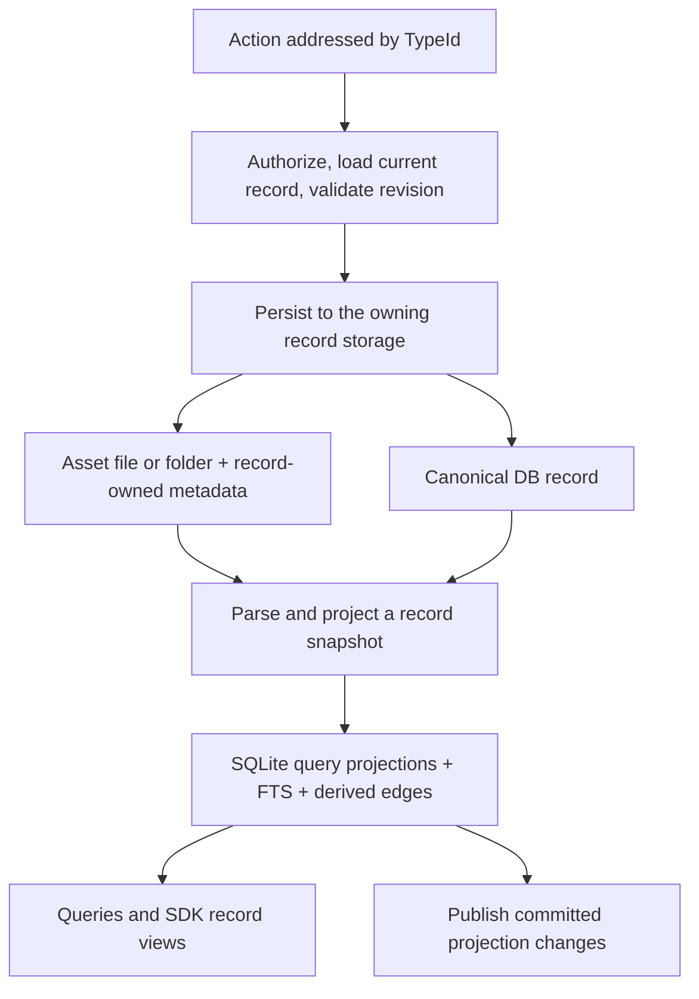

**Architectural alternative — remove the Entity layer**

Assessed 2026-09-06 against the working tree at HEAD `abb4a1274d50b4bc9435cfb6845616cfe594ff8c`, following the data-management review. This is a proposed architecture, not an adopted change to the repository's contracts. No application code or persisted data was changed for this assessment.

**Recommendation**

Yes: make Record the sole domain data model, retain assets as content storage, and make indexing a one-way projection. Remove Entity's independent persistence lifecycle and the need to translate between two domain objects. Keep TypeId, existing type values, UUIDs, the type registry, structured SQLite queries, FTS, actions and graph capabilities.

The necessary qualification is that **a record can exist without a file asset**. Source items, ingestion cursors, consumer positions and tabs already do. They should use the same record API with DB storage. Requiring a filesystem asset for every operational row would introduce additional persistence and transaction costs. This proposal assumes “assets and their records” includes records whose canonical storage is a DB row.

This changes the earlier review's recommendation to preserve the record/entity/asset separation: the responsibilities remain useful, but the separate Entity domain model does not need to remain. The original findings still apply to the current implementation.

**What the architecture becomes**

The two storage branches are alternatives selected by the type/origin; a mutation does not automatically write both. External asset edits enter through the same parsing and projection path. A record is one typed logical object; a source-owned body and record-owned local metadata can have different physical storage, with ownership declared per field.

| Responsibility | Proposed owner | Consequence |
|---|---|---|
| Identity and type | Existing TypeId, UUID minter and TypeInfo | URLs, references and wire type values need not change. |
| Typed fields and validation | One record schema per type, bound through TypeInfo | A single concrete generic Record can carry typed payloads; no per-type FSRecord inheritance hierarchy. |
| File/folder content | Existing origin/layout/serializer capabilities | Parse into record data directly; serialize only the fields owned by that asset. |
| Local metadata and records without assets | Canonical record storage | Preserve authoritative state through index rebuilds. A DB record can be queried directly through ordinary indexes without another full row mirror. |
| Search, filtering, paging and path lookup | Structured SQLite query layer and FTS | Index rows are read-only projections at the application boundary; they do not have an independent save lifecycle. |
| Commands and type-specific actions | Backend functions using records, registered by type | Preserve action names and permissions; remove the requirement for an Entity instance or class receiver. |
| Relationships and authorization | Canonical record fields or durable relationship/permission storage | Build reverse edges and read projections from durable facts; retain existing graph APIs. |
| Runtime processes and connections | Existing runtime services keyed by TypeId | Runtime handles do not become serializable record fields. Persist only the required configuration/status. |
| SDK state | Cached record views and existing change envelopes | Existing API shapes and client names can remain during migration; navigation remains URL-first. |

Keep SQLite as a structured index. FTS alone cannot replace ordered metadata queries, natural-key lookups, scoped filtering, joins, counts and relationship traversal. The SQL table may initially retain its existing name while its ownership changes; renaming it is not a prerequisite for removing the domain layer.

**Where DBRecord fits — clarification**

DBRecord belongs in this design as the database representation of the common record contract. The existing foundation is named `DBBaseRecord`: today's inheritance runs from a concrete type through `Entity` → `DBEntity` → `DBBaseRecord`. The base already supplies TypeId, audit fields, field policies and schema helpers. Preserve those useful responsibilities while removing its Entity-class registration and DB-specific coupling from the shared data model. See [DBBaseRecord](/Users/shlom/Documents/dev/flowpad-oss/flow_sdk/db/drivers/db_base_record.py:91).

| Record category | Canonical state | Role of the DB record |
|---|---|---|
| File/folder asset | Asset-owned fields plus FSRecord's canonical local metadata | Rebuildable structured query projection. |
| Record without an asset | DB record | Authoritative data; ordinary indexes and FTS are derived from it. |

FSRecord and DBRecord can be storage representations of one typed record contract. They should share field definitions and validation, with storage-specific serialization beneath them. Neither needs the existing Entity/DBEntity action and persistence inheritance. For an asset, indexing writes the DB projection directly from the parsed record snapshot. For a canonical DB record, commands write its row directly and update the applicable secondary projections. Reindexing must never delete canonical rows under the assumption that every DB record is a cache.

This distinction may be enforced by separate tables/stores or by explicit storage policy; the class name alone cannot establish whether a row is disposable. Keep business actions in backend functions, SQL transactions/query execution in the driver, and type-specific schema/storage policies in TypeInfo. DBRecord should not become a second independently writable domain object for an asset-backed record.

The existing `DbSerializer` is reusable: it already defines persisted fields, natural-key lookup and digest-based no-op handling. Its calls to typed classes' `get_one`/`get_all`, and the SQLite driver's `_schema_to_entity` construction, must move to the record contract. Removing the two inheritance layers alone would leave these dependencies unresolved. See [DbSerializer](/Users/shlom/Documents/dev/flowpad-oss/flow_sdk/fs_store/serializer/db.py:75) and [SQLite hydration](/Users/shlom/Documents/dev/flowpad-oss/flow_sdk/db/drivers/sqlite/sqlite_driver.py:2967).

**Why this is more than a rename**

The current extractor constructs a typed Entity through `serializer().load(info.entity_cls, ...)`, dumps it into an FSRecord, and indexing constructs an Entity again through `Entity.from_record`. A direct serializer → typed record snapshot → index projection removes that cycle. See [record extraction](/Users/shlom/Documents/dev/flowpad-oss/flow_sdk/fs_store/serializer/record.py:49), [record adoption](/Users/shlom/Documents/dev/flowpad-oss/flow_sdk/core/entity/entity_model.py:962) and [sync orchestration](/Users/shlom/Documents/dev/flowpad-oss/flow_sdk/fs_store/fs_record.py:958).

Today `Entity.save` writes the row and calls storage; disk adoption enters that same lifecycle and suppresses storage to prevent writing back to the source. The target has two explicit operations: persist a command to its authoritative storage, and project an existing canonical snapshot. Reindexing never invokes business commands, recreates domain objects with save hooks, or writes a queried projection back to its source. See [Entity.save](/Users/shlom/Documents/dev/flowpad-oss/flow_sdk/core/entity/entity_model.py:2469).

Record should remain a small data object. Transplanting all Entity methods into Record would retain the current coupling. Persistence, authorization and action execution need focused functions at their owning layers, with the current registry supplying per-type facts. This does not require another parallel registry or a manager class for every capability.

The current code already supplies useful foundations. TypeInfo declares serializers, origin kinds, field membership, natural keys and FTS inputs. The action registry already accepts top-level type-scoped functions. The integration that injects `self` or `cls` from Entity is what must change. See [TypeInfo storage declarations](/Users/shlom/Documents/dev/flowpad-oss/flow_sdk/fs_store/schema_registry.py:285), [action registration](/Users/shlom/Documents/dev/flowpad-oss/flow_sdk/actions/action_registry.py:115) and [action receiver injection](/Users/shlom/Documents/dev/flowpad-oss/flow_sdk/server/routes/graph.py:450).

**Authority must be explicit**

An asset-backed record can present one logical payload while preserving distinct field owners. The source document owns its body and declared frontmatter; canonical record metadata owns local fields absent from the document; indexes own only derived values. An indexed title or cached body is never an alternate source for a later edit.

The existing `asset_spec` is not automatically the complete record schema. For example, TaskSpec deliberately excludes sender-local project/process fields because it also defines what is shared. Reusing it as the entire model would lose local data or encourage accidentally sharing it. Define each field once with its storage, projection and sharing policy, then derive the required representations. Preserve lenient compatibility for old stored metadata separately from strict command validation. See [TaskSpec](/Users/shlom/Documents/dev/flowpad-oss/flow_sdk/builtin/task.py:35) and [derived metadata membership](/Users/shlom/Documents/dev/flowpad-oss/flow_sdk/fs_store/schema_registry.py:465).

For relationships, `parent_type_id` and `group_id` already have canonical metadata membership. Derived backlinks and inverse containment edges can be rebuilt. User-authored dependencies, permissions and other edges need durable ownership before their current Entity/DB facilities are retired. A table containing the sole copy of an ACL or dependency is canonical storage, even if it shares a database with the index. See [BaseMeta](/Users/shlom/Documents/dev/flowpad-oss/flow_sdk/schema/type_info/base_meta.py:20) and [DBEntity relationship operations](/Users/shlom/Documents/dev/flowpad-oss/flow_sdk/db/db_entity.py:725).

SourceItem is already a useful example: its DB row is the record, identified idempotently through a natural key, with FTS derived from its body. Cursors and tabs similarly declare `db_only`. They need preservation, not fabricated source files. See [SourceItem metadata](/Users/shlom/Documents/dev/flowpad-oss/flow_sdk/schema/type_info/source_item_type_info.py:1), [cursor storage policy](/Users/shlom/Documents/dev/flowpad-oss/flow_sdk/schema/type_info/data_source_type_info.py:54) and [Tab storage policy](/Users/shlom/Documents/dev/flowpad-oss/flow_sdk/schema/type_info/tab_type_info.py:1).

**Expected benefits and limits**

The strongest structural benefit is one authoritative mutation path. It removes the need to keep independently writable Entity and record representations in agreement, and removes Entity construction from indexing. Shared schemas can reduce repeated field declarations. Queries can return lightweight indexed views and hydrate only the requested record/body. Source parsing can produce FTS input without persisting another identical body string in the shadow.

Source-owned fields need not be duplicated in canonical record metadata; any retained copy must be an explicitly disposable cache or a deliberate snapshot with its own retention contract. Record-owned metadata must remain durable. Offline access requirements determine whether cached content can be removed. Eliminating the duplicate `content` field is independently useful and does not require deleting the entire Entity layer.

The architecture alone does not fix incomplete-scan deletion, missing gitignore exclusions, repeated directory walks, carrier races, query pagination, index-generation invalidation, incompatible LLM sidecars or SDK request races. Those still need their specific corrections. Explicit-null versus omitted-field semantics also remain necessary with a single record model.

**SLOC implications**

The measured central migration surface is **3,888 production SLOC in six files**. This uses the same physical code-line definition as the original estimate: no blank lines, comments or Python docstrings; executable strings and declarations count.

| Current file | Measured SLOC | What can happen to it |
|---|---:|---|
| `core/entity/entity_model.py` | 2,114 | Remove record/Entity translation and duplicate persistence; migrate remaining schema, action, sharing, blob and lifecycle behavior. |
| `db/db_entity.py` | 939 | Replace object persistence/dirty tracking where unnecessary; retain query, permission and relationship capabilities in their owning modules. |
| `fs_store/fs_record.py` | 626 | Remove Entity synchronization; retain identity, metadata, source references, locking and necessary freshness/recovery behavior. |
| `fs_store/serializer/record.py` | 48 | Parse directly to record data; retain extraction and FTS composition. |
| `fs_store/record_list.py` | 53 | Consolidate generic CRUD with the one record storage API. |
| `fs_store/record_query.py` | 108 | Use indexed queries; retain an explicit recovery/unindexed discovery path. |
| **Total** | **3,888** | **Migration surface, not removable code.** |

A static AST inventory also found 92 direct `Entity` subclasses under `flow_sdk`, including a benchmark fixture, and 55 files importing `Entity` directly from `entity_model`. These are dependency indicators, not a count of registered production types or a complete consumer inventory; indirect imports and subclasses add more reach.

The DBRecord clarification adds two supporting files to the measured scope: `db/drivers/db_base_record.py` is **308 SLOC**, and `fs_store/serializer/db.py` is **87 SLOC**. Together with the six-file baseline, that is **4,283 SLOC across eight files**. These are additional migration dependencies, not additional deletion savings. The evidence counter records the original six-file subtotal separately from these supporting files.

The earlier **300–720 net SLOC** estimate applies to the original bounded consolidation plan. It is not a forecast for this replacement architecture and must not be added to 3,888. Most business behavior in these files survives in other modules, while adapters and recovery code add lines. A defensible whole-layer net estimate needs a representative vertical implementation that measures deleted code against all replacement and compatibility code. The current evidence does not support a new repository-wide deletion percentage or a claim that all Entity subclasses disappear without replacement schemas/actions.

The measured counts and source hashes are recorded in [entity-removal-scope.json](/Users/shlom/Documents/dev/flowpad-oss/reports/data-management-review-2026-09-06/evidence/entity-removal-scope.json). The inventory is static; no removal prototype was implemented for this assessment.

**Risk analysis for this alternative**

| Risk | Severity | Required design/validation |
|---|---|---|
| Dropping authoritative state while deleting an “index” | Critical impact; high migration risk | Classify field/table authority. Rebuild only disposable projections; prove cursors, records without assets, metadata, ACLs and authored relationships survive. |
| Moving actions off Entity changes authorization or side effects | High | Keep public action contracts, execute authorization at the command/read boundary, and verify sharing, child events and runtime actions. Reindex must not trigger business workflows. |
| A file succeeds but its metadata/index update fails | High | Persist a recoverable revision/checkpoint; report incomplete projection explicitly. Failure injection must demonstrate recovery to the canonical snapshot without overwriting a newer external edit. |
| Losing identity ownership when the index is deleted | High | Preserve UUIDs and durable record identity/path claims. Test carrier loss, copies, moves, read-only assets and a missing index; never replace natural-key lookup with new deterministic IDs. |
| Stale projections influence writes or permissions | High | Commands load current canonical state and validate its revision. Authorization-sensitive reads must not grant access from an obsolete permission projection. |
| Old and new code both write the same record | High during migration | Exactly one mutation owner per migrated type/cohort; compatibility adapters delegate to it. Shadow comparison is read-only and cannot mint carriers or publish domain events. |
| API/SDK consumers assume Entity methods or class schemas | Medium–high | Retain wire adapters and existing type values; inventory Python consumers as well as REST/WS clients. Public Python method consumers need an explicit compatibility policy. |
| Record becomes another large persistence object | Medium; undermines the benefit | Keep record data separate from action/runtime services and prohibit independent saves from query projections. Measure total code, not file deletion. |

A single domain model does not create a cross-filesystem/SQLite transaction. For DB records, canonical writes and projections may share a SQLite transaction. For assets plus local metadata, define recoverable ordering across stores. Publish the normal “query state changed” event only after the relevant projection commits. Canonical persistence and projection readiness are separate completion facts if indexing can lag. Delivery across a process crash requires an explicit recoverable delivery contract; an in-memory after-commit callback alone cannot guarantee it.

Rebuildable projections need a completion token for the actual source revision, parser revision and index generation. A rebuild must reconstruct all declared projections from canonical stores without issuing domain create/update commands. It must preserve the read-only nature of computed fields such as transcript-derived counts; the current [ProjectedFields guard](/Users/shlom/Documents/dev/flowpad-oss/flow_sdk/core/entity/projected_fields.py:33) demonstrates an existing ownership rule that the new schema must retain.

**A practical migration**

1. Write an authority inventory for each storage family: file/folder assets, canonical metadata records, DB records and remote mirrors. Mark each field as canonical, projected or transient; identify authoritative relationships and permissions.
2. Separate one type's data schema from Entity. Make its serializer and projector operate on record data without constructing or saving Entity. Keep TypeId and existing response schemas stable.
3. Prove three representative vertical slices: Markdown for source content/external edits, Task for local metadata and actions, and SourceItem for canonical DB storage/natural-key ingestion. Migrate both read and write behavior for each slice to one owner.
4. Exercise create/edit/clear/reload/reindex/delete, source changes during parsing, index loss, partial failures, stable identity and authorization. Count all new production code and remaining compatibility code before revising the SLOC estimate.
5. Migrate remaining actions and authoritative relations, then remove Entity/DBEntity persistence and the compatibility machinery once their consumers have moved. Keep unrelated scanner, search, LLM-sidecar and SDK fixes independently reviewable.

The decisive recovery test is: remove only the declared query projections, rebuild them from assets and canonical records, and obtain the same identities, content, metadata, relationships and permissions, with operational records intact and no business actions replayed. Passing this test would establish the simpler architecture's main promise.

**Decision**

Prefer the record-only domain model as the long-term direction, with TypeId and index/query capabilities retained. Validate the architecture through the three storage/action slices before committing to wholesale removal. Migration risk is high; the eventual reduction in synchronization states is a strong reason to pursue the design, but neither performance gains nor net SLOC deletion are established by this analysis alone.
